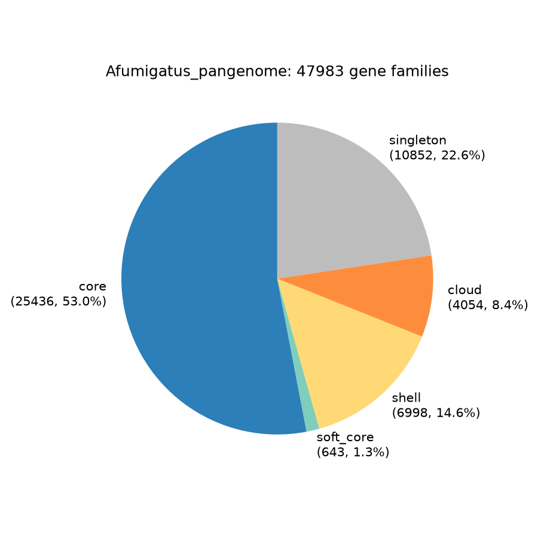
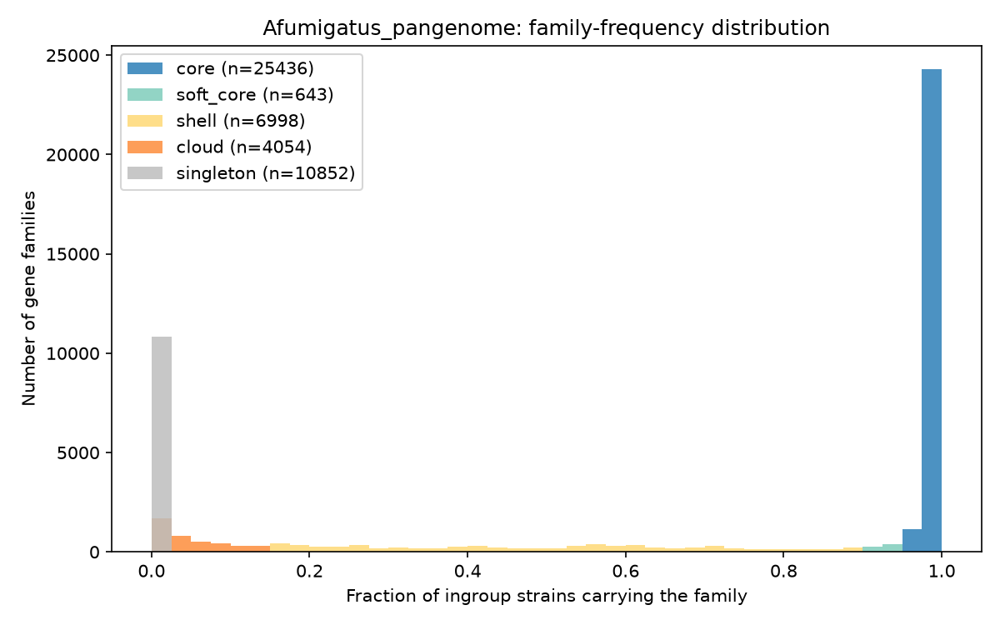
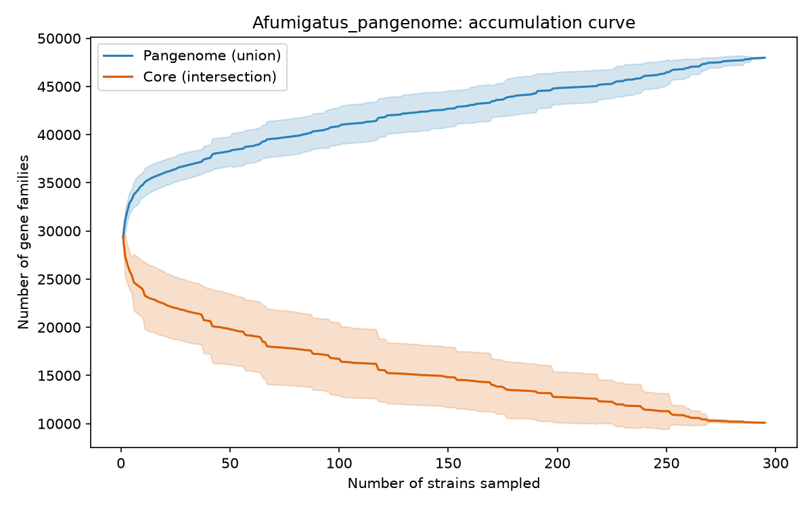
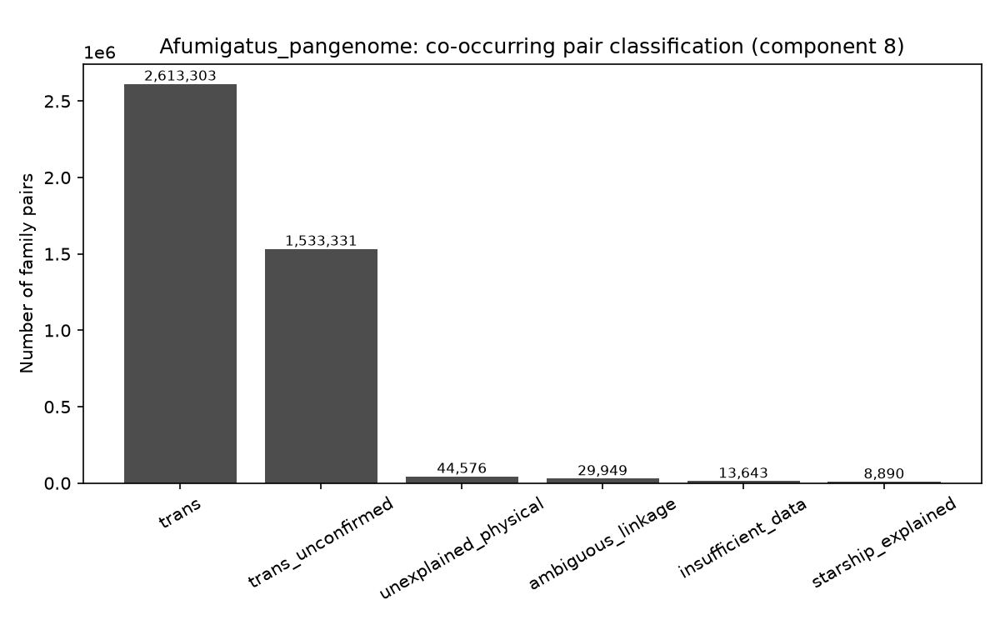
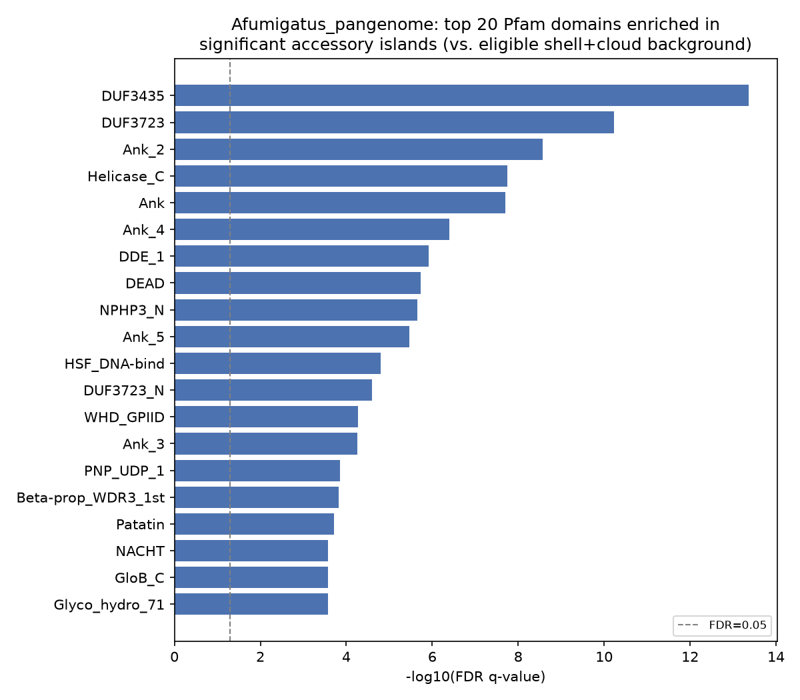

# Afumigatus_pangenome — full corrected results report

**295 genomes (293 *Aspergillus fumigatus* ingroup + 2 outgroup: *A. lentulus*, *A. fischeri*)**
**Status: corrected, 2026-09-15; extended 2026-09-17.** Two real bugs found and
fixed the same day (tblastn truncation, missing rescue-pass positions) — see
"Correction history" below before citing any number in this report against an
earlier version of the pipeline's output. 2026-09-17 additions: starbase Starship
boundary cross-validation (§10 Open Items), trans-network-module functional
annotation, and a hetA-E heterokaryon-incompatibility locus cross-reference
(§9, detail in `GENE_CLUSTER.md`).

Figures referenced below are in `figures/*.png` (raster, for viewing) and
`figures_pdf/*.pdf` (vector, for print/manuscript use — identical content). Full
per-metric tables in `SUMMARY.md`. Raw data in `full_293run/*.rescued.tsv`,
`id_crosswalk/*.tsv`, `full_293run/modules_preview/*.tsv`.

---

## 1. Correction history (read this first)

Two independent, verified bugs were found and fixed on 2026-09-15, both changing the
headline numbers substantially:

1. **tblastn rescue-pass truncation.** The genome-level rescue pass (recovering gene
   families missed by protein annotation) used `-max_target_seqs 5` against one combined
   295-strain BLAST database — a cap on hits *per query across the whole database*, not
   per strain. Verified: 89.4% of hit queries hit exactly the 5-strain cap. Fixed by
   redesigning to one BLAST database per strain (`run_rescue_pass_per_strain.sh`).
2. **Missing rescue-pass positions.** After fix #1, `pair_classification.py` couldn't
   resolve ~96% of pairs, because a rescue-pass hit has no annotated gene model, so it
   had no position in `family_positions.tsv`. Fixed by deriving positions directly from
   each hit's own genomic coordinates (`bin/extract_rescue_positions.py`).

| Metric | Pre-fix | Post-fix (this report) |
|---|---:|---:|
| Core families | 13.8% | **53.0%** |
| Singleton families | 57.6% | **22.6%** |
| Physically-linked co-occurring pairs | 10,687 | **83,415** |
| `insufficient_data` (pair classification) | 6.0% | **0.3%** |

Full technical detail: `PANGENOME_CLUSTER_PROFILE_NOTES.md`.

---

## 2. Pangenome composition

| Bin | Families | % of total |
|---|---:|---:|
| Core | 25,436 | 53.0% |
| Soft-core | 643 | 1.3% |
| Shell | 6,998 | 14.6% |
| Cloud | 4,054 | 8.4% |
| Singleton | 10,852 | 22.6% |
| **Total** | **47,983** | **100.0%** |




**The pangenome is open, not saturated.** The accumulation curve (20 random-order
permutations) shows neither the pangenome-size curve nor the core-size curve has
plateaued at n=295 — both are still moving in the same direction they started in.



---

## 3. Assembly/annotation quality control

| Metric | Value |
|---|---:|
| Strains assessed | 295 |
| Complete BUSCO % (min / median / max) | 96.7 / 98.8 / 99.4 |
| Strains with >100 contigs (draft-consistent) | 279 |
| Strains with ≤20 contigs (near-chromosome) | 13 |

Completeness is uniformly high and narrow — not a confound for any "missing family"
call in this panel.

**Resolved outlier**: `Asfu_H1106` (strain `H-1-10-6`, `GCA_020501995.1`) shows an
elevated shell/cloud/singleton family count (6,197 vs. panel median 3,591), traced to
protein-level annotation, not the rescue pass. BUSCO (98.7%), contig count (678,
non-extreme), total protein count (10,961, normal range), and annotation source (NCBI,
same as 292/295 strains) were checked first and ruled out.

Follow-up with `mash dist` against all 295 sketches (2026-09-16) answers the two
remaining questions directly:

- **Not a different species.** `Asfu_H1106`'s nearest-neighbor Mash distance is
  0.00116 (nearest neighbor `Asfu_K18L3`), squarely inside the panel's normal
  intra-*A. fumigatus* range (median nearest-neighbor distance across all 295 strains:
  0.00061; the most divergent *bona fide* ingroup strain, `Asfu_eAF1436`, sits at
  0.00385). Its distance to the two outgroups (*A. fischeri* 0.0669, *A. lentulus*
  0.0932) is 40-60x larger. It nests normally inside the ingroup — no support for
  cryptic species or a sample mix-up.
- **The excess is concentrated almost entirely in singleton families**, not shell,
  cloud, or genome-only calls: 1,430 strain-private singleton families vs. a panel
  median of 11 (stdev 91; z ≈ 15.6 — by far the most extreme value of any strain, next
  highest is 376). Shell (z ≈ 1.5) and cloud (z ≈ 1.0) counts are only mildly elevated.
  These 1,430 private families sit on 1,320 distinct contigs of this assembly (1,920
  gene-bearing contigs total), and disproportionately on small, gene-sparse contigs —
  many contigs carry only 1-2 genes total, of which all or most are one of these
  singletons. Their representative-protein length is also shorter than typical (median
  164 aa vs. 262 aa panel-wide).

**Conclusion: assembly-fragmentation artifact, not novel accessory biology and not a
different species.** The pattern (genetically unremarkable placement + private genes
concentrated on tiny orphan contigs + shorter-than-typical protein length) matches
genes split or truncated across contig breaks in this particular assembly, producing
protein fragments that fail to cluster with their true ortholog family and get counted
as spurious "new" singleton families. **Decision: kept in the panel for
core/soft-core/shell/cloud-based analyses** (those bins are unaffected — normal
values), **but its 1,430 private singleton calls should not be read as evidence of
real unique accessory gene content for this strain**, and any singleton-count-based
per-strain comparison should treat `Asfu_H1106` as an assembly-quality-driven outlier
rather than a biological one.

---

## 4. HAC / hacA targeted screen

| Locus | Present in | % of strains |
|---|---:|---:|
| hacA (Afu3g04070) — core UPR transcription factor | 293/293 | 100.0% |
| hrmA ortholog — subtelomeric, Starship-mobile HAC element | 8/293 | 2.7% |

A broad Pfam-family screen (PF11001) is **not usable** as a presence/absence marker —
it hits every strain (3-9 hits each), because it's an ancient, non-mobile paralogous
domain family, not specific to the Starship-mobile copy. The direct sequence-identity
screen resolves this: 8 strains carry the true hrmA ortholog, one (`Asfu_Af293`)
confirmed exactly against the published Starship `Nebuchadnezzar-h1` at the same base
coordinate.

---

## 5. Co-occurrence and pair classification — is loss/gain limited to Starships?

**Short answer: no.** There are 4,243,692 statistically robust (FDR<0.05, exact
clade-stratified test) co-occurring family pairs, and Starship-explained pairs are a
small minority even among the physically-linked ones.

| Classification | Pairs | % of total | What it means |
|---|---:|---:|---|
| trans | 2,613,303 | 61.6% | Not physically clustered; co-occurrence survives the clade-permutation null (not just population structure) |
| trans_unconfirmed | 1,533,331 | 36.1% | Not physically clustered; fails the permutation null (likely explained by shared clade membership) |
| **unexplained_physical** | **44,576** | **1.1%** | **Physically clustered — a real co-located, coordinately-varying gene block — with NO Starship captain gene nearby** |
| ambiguous_linkage | 29,949 | 0.7% | Partial physical clustering |
| insufficient_data | 13,643 | 0.3% | Too few resolvable co-carrying strains |
| **starship_explained** | **8,890** | **0.2%** | **Physically clustered AND a Starship captain gene sits nearby — mechanism identified** |



**There are 5x more `unexplained_physical` pairs than `starship_explained` ones.**
Among the 83,415 physically-linked pairs (starship_explained + unexplained_physical +
ambiguous_linkage), the *majority* have no identified mechanism. A concrete example —
one of the strongest `unexplained_physical` pairs (jaccard = 1.0, adjacent genes,
identical strain distribution, consistent "loss" direction across clades):

```
Neofi_ref|tr|A1DK62|A1DK62_ASPF1  ×  Neofi_ref|tr|A1DK67|A1DK67_ASPF1
  classification: unexplained_physical | linkage_fraction: 1.00 | jaccard: 1.00
  fisher_p: 1.58e-11 | fdr_q: 1.31e-09 | permutation_p: 0.0000 | direction: loss
```

This is real, tight, coordinated gene loss — not a statistical artifact (fdr_q ~1e-9,
permutation_p essentially 0) — with no Starship captain gene detected nearby. Whether
this reflects a different mobile-element family, simple deletion of a co-regulated
operon-like block, or some other mechanism is an **open question this pipeline
surfaces but does not resolve**. `results/full_293run/pair_classification.rescued.tsv`
has the full list, filterable on `classification == "unexplained_physical"`, sorted by
`jaccard`/`fdr_q` for the strongest, most confident candidates to follow up on.

**The `trans` category (61.6% of all significant pairs) is a separate phenomenon.**
These are NOT physically linked at all — two genes at different genomic locations
whose presence/absence correlates across strains. This is not "pattern of physical
loss/gain," but could reflect shared selective pressure, epistasis, or an unmodeled
confound. It is the largest category by far and not explored further by this pipeline
version.

### Are the physically-linked pairs part of real, larger multi-gene islands?

Yes — and most of them are unexplained by either mechanism this study checked. Ran
`bin/synteny_windows.py`'s `accessory_islands()` (tested during design, never
previously run on real data) against all 295 strains via a new script,
`bin/find_accessory_islands.py`, merging maximal runs of consecutive non-core genes
into islands, then keeping only islands that contain a statistically significant
physically-linked pair (not just any non-core run). Cross-referenced each island
against the existing Starship captain-gene (DUF3435) screen and a new secondary-
metabolite backbone screen (PKS ketosynthase `PF00109`, NRPS condensation domain
`PF00668`; `results/sm_backbone/`).

**Result: 12,861 distinct significant islands** (2–837 genes, median 7 — the largest
are very likely extended subtelomeric/repeat-rich regions, not compact gene clusters;
realistic biosynthetic-gene-cluster candidates sit in the 3–30 gene range).

| Captain gene (Starship) | SM backbone gene (PKS/NRPS) | Distinct islands |
|---|---|---:|
| No | No | 11,741 (91.3%) |
| Yes | No | 904 (7.0%) |
| No | Yes | 151 (1.2%) |
| Yes | Yes | 65 (0.5%) |

**91.3% of significant physical-linkage islands have neither mechanism identified.**
One concrete, checkable example in the realistic size range: a 30-family island in
strain `Asfu_G2141` (246 supporting pairs) contains the reviewed Swiss-Prot entry
`Asfu_Af293|sp|Q4WKX2|FGND_ASPFU`, carries a PKS/NRPS backbone hit, and has **no**
Starship captain gene — a real candidate secondary-metabolite-associated accessory
island independent of Starship mobilization. Full list:
`results/accessory_islands/significant_islands.tsv`.

*Caveats*: the captain-gene/SM-backbone flags are cohort-level (any strain, any copy
of that family) — a "Yes" doesn't confirm the specific copy in that specific island
carries the domain. The 12,861 count is "distinct exact member sets," not
non-overlapping loci — a larger island in one strain and a smaller nested subset in
another both count separately.

*Performance note*: the naive version of this cross-reference (checking all 83,415
significant pairs against every island) was killed after 12+ minutes with zero
output — an O(islands × pairs) blowup. Fixed with a family-indexed lookup
(Fable-reviewed, confirmed correct and empirically safe at this dataset's scale);
the real run then took 2 minutes.

### What functions are these islands enriched for?

Ran a real Pfam-A hmmscan (30,134 profiles) against all 11,052 families eligible for
co-occurrence testing (the 9,224 in significant islands plus the 2,620 additional
eligible families needed for a correctly-scoped background), then tested each Pfam
domain for enrichment among island-member families vs. that background (one-sided
Fisher's exact, BH-FDR corrected) — **901 domains tested, 71 significant at FDR<0.05**.

| Domain | Islands / background | Interpretation |
|---|---:|---|
| [DUF3435](https://www.ebi.ac.uk/interpro/entry/pfam/PF11917/) | 199/205 | The Starship captain domain itself — internal-consistency check |
| [DUF3723](https://www.ebi.ac.uk/interpro/entry/pfam/PF12520/) | 109/109 | Documented as part of the broader Starship "backbone" beyond the captain gene — some of the "unexplained" islands may still be Starship-associated via a signal outside this study's narrower DUF3435-only screen |
| [Ank](https://www.ebi.ac.uk/interpro/entry/pfam/PF00023/) / [Ank_2](https://www.ebi.ac.uk/interpro/entry/pfam/PF12796/)–[Ank_5](https://www.ebi.ac.uk/interpro/entry/pfam/PF13857/) (ankyrin repeat) | up to 215/231 | Documented Starship-cargo-associated domain family in other fungi |
| **[DDE_1](https://www.ebi.ac.uk/interpro/entry/pfam/PF03184/) (DDE transposase)** | 68/68 | **Independent evidence of a different mobile-element family** — direct support for the hypothesis that some unexplained_physical islands reflect a non-Starship transposon |
| [NACHT](https://www.ebi.ac.uk/interpro/entry/pfam/PF05729/) | 70/73 | Fungal heterokaryon-incompatibility/innate-immune-like genes — classic accessory-genome category |
| [Glyco_hydro_71](https://www.ebi.ac.uk/interpro/entry/pfam/PF03659/), [Patatin](https://www.ebi.ac.uk/interpro/entry/pfam/PF01734/) | ~55 each | Secreted cell-wall-modifying/lipase enzymes — another classic horizontally-variable category |



**Full data file, with FDR included, sorted by island size**:
`results/accessory_islands/significant_islands.with_enrichment.tsv` — every distinct
significant island, sorted largest-first, with its full Pfam domain list, which of
those domains clear FDR<0.05, and each one's q-value
(`bin/annotate_islands_with_enrichment.py`, joining `significant_islands.with_domains
.tsv`'s per-island domain lists against `domain_enrichment.tsv`'s per-domain q-values
— neither source file alone has both). **5,712 of 12,861 islands (44.4%) carry at
least one FDR-significant domain.** For direct hotlinks, use
`results/accessory_islands/domain_enrichment.with_urls.tsv` instead of the plain
`domain_enrichment.tsv` — same 901-domain table plus `pfam_accession`/`pfam_url`
columns (`bin/add_pfam_urls.py`, canonical `https://www.ebi.ac.uk/interpro/entry/
pfam/<ACCESSION>/` links — Pfam is now hosted under InterPro, pfam.xfam.org is
retired).

**12 concrete examples**, spanning the full range of strain support (1–187 strains)
and island size (3–30 genes):

| Island (strain, size) | Strains supporting | Classification(s) | Captain gene | Top domains (FDR q) |
|---|---:|---|:---:|---|
| `Asfu_HMR_AF_270`, 8 genes | 187 | unexplained_physical | N | [NPHP3_N](https://www.ebi.ac.uk/interpro/entry/pfam/PF24883/) (2.2e-06), [WHD_GPIID](https://www.ebi.ac.uk/interpro/entry/pfam/PF22939/), [NACHT](https://www.ebi.ac.uk/interpro/entry/pfam/PF05729/), [NB-ARC](https://www.ebi.ac.uk/interpro/entry/pfam/PF00931/) |
| `Asfu_CNMCM8686`, 6 genes | 170 | unexplained_physical | N | [Patatin](https://www.ebi.ac.uk/interpro/entry/pfam/PF01734/) (1.9e-04) |
| `Asfu_niveus`, 3 genes | 158 | unexplained_physical | N | [NPHP3_N](https://www.ebi.ac.uk/interpro/entry/pfam/PF24883/) (2.2e-06) |
| `Asfu_HMR_AF_270`, 4 genes | 132 | unexplained_physical | N | [Ank_2](https://www.ebi.ac.uk/interpro/entry/pfam/PF12796/), [Ank_4](https://www.ebi.ac.uk/interpro/entry/pfam/PF13637/), [NPHP3_N](https://www.ebi.ac.uk/interpro/entry/pfam/PF24883/), [Ank_5](https://www.ebi.ac.uk/interpro/entry/pfam/PF13857/), [WHD_GPIID](https://www.ebi.ac.uk/interpro/entry/pfam/PF22939/), [PNP_UDP_1](https://www.ebi.ac.uk/interpro/entry/pfam/PF01048/) (2.7e-09) |
| `Asfu_HMR_AF_270`, 5 genes | 116 | unexplained_physical | N | [WD40_CDC20-Fz](https://www.ebi.ac.uk/interpro/entry/pfam/PF24807/), [WD40_Prp19](https://www.ebi.ac.uk/interpro/entry/pfam/PF24814/) (2.7e-04) |
| `Asfu_NRZ2018236`, 30 genes | 1 | ambiguous_linkage, starship_explained, unexplained_physical | Y | [DUF3435](https://www.ebi.ac.uk/interpro/entry/pfam/PF11917/), [DUF3723](https://www.ebi.ac.uk/interpro/entry/pfam/PF12520/), Ank×3, [NPHP3_N](https://www.ebi.ac.uk/interpro/entry/pfam/PF24883/), [NACHT](https://www.ebi.ac.uk/interpro/entry/pfam/PF05729/) +5 more (4.4e-14) |
| `Asfu_B170s1`, 30 genes | 2 | ambiguous_linkage, unexplained_physical | N | [Ank_2](https://www.ebi.ac.uk/interpro/entry/pfam/PF12796/), [Ank](https://www.ebi.ac.uk/interpro/entry/pfam/PF00023/), [Ank_4](https://www.ebi.ac.uk/interpro/entry/pfam/PF13637/), [Ank_5](https://www.ebi.ac.uk/interpro/entry/pfam/PF13857/), [Ank_3](https://www.ebi.ac.uk/interpro/entry/pfam/PF13606/), [Myb_DNA-bind_6](https://www.ebi.ac.uk/interpro/entry/pfam/PF13921/) (2.7e-09) |
| `Asfu_NRZ2017339`, 30 genes | 2 | ambiguous_linkage, unexplained_physical | N | [Helicase_C](https://www.ebi.ac.uk/interpro/entry/pfam/PF00271/), [DEAD](https://www.ebi.ac.uk/interpro/entry/pfam/PF00270/), [GloB_C](https://www.ebi.ac.uk/interpro/entry/pfam/PF28402/), [Pkinase](https://www.ebi.ac.uk/interpro/entry/pfam/PF00069/) (1.8e-08) |
| `Asfu_E12510`, 30 genes | 3 | ambiguous_linkage, starship_explained, unexplained_physical | N | [NPHP3_N](https://www.ebi.ac.uk/interpro/entry/pfam/PF24883/), [HSF_DNA-bind](https://www.ebi.ac.uk/interpro/entry/pfam/PF00447/), [WHD_GPIID](https://www.ebi.ac.uk/interpro/entry/pfam/PF22939/), [NACHT](https://www.ebi.ac.uk/interpro/entry/pfam/PF05729/), [APH](https://www.ebi.ac.uk/interpro/entry/pfam/PF01636/) (2.2e-06) |
| `Asfu_E166s1`, 30 genes | 5 | ambiguous_linkage, starship_explained, unexplained_physical | Y | [DUF3435](https://www.ebi.ac.uk/interpro/entry/pfam/PF11917/), [GloB_C](https://www.ebi.ac.uk/interpro/entry/pfam/PF28402/), [APH](https://www.ebi.ac.uk/interpro/entry/pfam/PF01636/) (4.4e-14) |
| `Asfu_NRZ2018649`, 30 genes | 5 | ambiguous_linkage, unexplained_physical | N | [Pkinase](https://www.ebi.ac.uk/interpro/entry/pfam/PF00069/), [Myb_DNA-bind_6](https://www.ebi.ac.uk/interpro/entry/pfam/PF13921/) (1.1e-03) |
| `Asfu_E174s1`, 30 genes | 7 | ambiguous_linkage, unexplained_physical | N | [HSF_DNA-bind](https://www.ebi.ac.uk/interpro/entry/pfam/PF00447/) (1.6e-05) |

**Independent cross-validation via SwissProt homology + GO terms**: ran a real
diamond blastp of all 11,052 eligible families against a local SwissProt database
(787 families already carried an embedded UniProt accession in their own header —
free; another 3,196 got a real best-hit at E≤1e-5 in 49 seconds), plus mapped every
enriched Pfam domain to its standard Pfam2GO-derived GO term. Both independently
confirm the Pfam-only interpretation above, not just repeat it:

| Island | Pfam signal | SwissProt homolog | GO term |
|---|---|---|---|
| `Asfu_HMR_AF_270`, 8 genes (187 strains) | NACHT | ~~Phomopsin biosynthesis cluster protein D~~ **retracted, see below** | — |
| `Asfu_CNMCM8686`, 6 genes (170 strains) | Patatin | **Phospholipase A I** | lipid metabolic process |
| `Asfu_niveus`, 3 genes (158 strains) | NPHP3_N/NACHT | **NLR (nucleotide-binding leucine-rich-repeat) protein** | — |
| `Asfu_HMR_AF_270`, 4 genes (132 strains) | Ank_2/Ank_4/Ank_5 | **NLR protein** (same as above) | protein binding |
| `Asfu_HMR_AF_270`, 5 genes (116 strains) | WD40 repeats | *(no hit — genuinely novel)* | — |

The NACHT/NPHP3_N islands independently hitting bona fide NLR (nucleotide-binding
leucine-rich-repeat) proteins is a real, meaningful confirmation — NLR/NACHT genes
are the well-documented fungal non-self-recognition (heterokaryon incompatibility)
gene family, not a coincidental domain match.

**The "Phomopsin biosynthesis cluster" lead was tested directly (2026-09-16) and
retracted — it does not hold up.** A single SwissProt best-hit name is not, by
itself, evidence of real pathway homology: a genuine horizontally-shared or
orthologous biosynthetic gene cluster is defined by co-inheritance of *multiple*
genes together, so a real hit should show several of the island's genes matching
several different genes of the reference cluster, not one coincidental match. Built
a reusable test (`bin/cluster_homology_test.py`, 7 unit tests) for exactly this
question, then ran it for real: extracted the actual Phomopsin biosynthetic gene
cluster from *Diaporthe leptostromiformis* (Ding et al. 2016, PNAS 113:3527 —
30 SwissProt entries, `GN=phom*`: the precursor peptide phomA plus ~14 tailoring
enzymes/transporters/regulators) as the reference set, and blasted all 8 of the
island's genes against it. **Result: 0/8 query genes pass even a permissive bar
(E≤1e-5, ≥50% query coverage) — verdict `NOT_SUPPORTED`.** The one SwissProt hit
this island had (`Asfu_AfB6|KAM0113048.1` vs. phomC/PHOC1_DIALO, 45.6% identity,
E=3.6e-44) covers only 33% of the query length (158/482 aa), and that aligned
region corresponds to the query's own annotated **Cupin_2** domain (residues
384–445) — a common, structurally simple β-barrel fold found across huge numbers
of unrelated oxidoreductase/isomerase enzymes in both fungi and bacteria. This is a
textbook shared-promiscuous-domain coincidence, not cluster homology. **Correction
applied to the table above and to the open-items list**; this island's real
identity (NACHT/NB-ARC/WHD_GPIID domains) is most likely another instance of the
same fungal NLR/heterokaryon-incompatibility family the other rows in this table
independently converge on, not a secondary-metabolite lead. Full tables
(with FDR, Pfam links, GO terms, and SwissProt names together):
`results/accessory_islands/significant_islands.full_annotation.tsv` and
`results/accessory_islands/domain_enrichment.with_go.tsv`.

The first five rows are the most striking: **highly recurring** (116–187 of 295
strains carry the exact same island), small-to-moderate (3–8 genes),
`unexplained_physical` (no Starship captain gene at all), yet strongly enriched for
specific, interpretable domains — NPHP3_N and NACHT (both linked to fungal
non-self-recognition/heterokaryon-incompatibility systems), ankyrin repeats, WD40
repeats, and Patatin (secreted lipase). These read as real, conserved,
non-Starship-driven accessory gene modules, not one-off noise. `Asfu_NRZ2018236`
(row 6) is the richest single example — captain gene, DUF3723, ankyrin repeats, and
NACHT all in the same 30-gene island in one strain, a genuine candidate for a hybrid
or compound accessory locus worth manual inspection.

*Caveat found while spot-checking real output, not a bug*: an island's own Pfam
domains and why one of its pairs was called `starship_explained` don't always
overlap — `pair_classification.py`'s captain-gene check uses a fixed window around
the *pair*, not the island's own boundary, so a captain gene can be "nearby" by the
pair-level definition while sitting just outside the island itself.

### How much of the 61.6% `trans` bucket is really this k=10 window artifact? (2026-09-17)

A worked example (module rooted at `Asfu_08190230|KAK9559653.1`, 22 families,
jaccard=1.0 across 53/295 strains) showed this k=10-gene physical-linkage window is
sometimes too narrow for a real block: those 22 families sit contiguously on ONE
contig in a real carrier strain (`Asfu_UD1`, ranks 16514-16567, a 53-gene span) —
already recovered as a single significant island — yet many of that block's own
internal pairs were still labeled `trans` pairwise. `bin/k_sensitivity_sweep.py`
quantified how general this is: it recomputes physical linkage at k=20/30/50/100/
200/500 for every `trans`/`trans_unconfirmed`/`ambiguous_linkage` pair (4,176,583
candidates) without rerunning the full pipeline (`results/full_293run/
k_sensitivity_sweep.tsv`).

| k | Reclassified as physical | % of 4,176,583 candidates | → unexplained_physical | → starship_explained |
|---:|---:|---:|---:|---:|
| 20 | 39,462 | 0.94% | 27,647 | 11,815 |
| 30 | 70,327 | 1.68% | 42,708 | 27,619 |
| 50 | 115,147 | 2.76% | 57,028 (peak) | 58,119 |
| 100 | 172,323 | 4.13% | 44,796 | 127,527 |
| 200 | 204,564 | 4.90% | 22,567 | 181,997 |
| 500 | 208,552 | 5.00% | 10,126 | 198,426 |

**The window-cutoff effect is real but small in aggregate**: even at k=500 (50x
the default), only ~5% of the trans-labeled population reclassifies as physical —
the `Asfu_08190230` module is a genuine case, but not representative of the bulk
of `trans` calls. The 61.6% `trans` figure above is not primarily a window
artifact.

**A real confound in this specific sweep, not in the underlying data**:
`unexplained_physical` peaks at k=50 (57,028) then *falls* as k grows further
(10,126 by k=500), while `starship_explained` keeps climbing — because
`has_captain_evidence()` reuses the same swept k for the captain-gene proximity
check, so at k=500 a captain gene anywhere within 500 genes counts as "nearby,"
likely over-attributing pairs to Starship mechanism. A cleaner version would
decouple the physical-linkage window from the captain-evidence window; not done
here since it wasn't the question being asked, but a real caveat on the
`starship_explained` growth curve above, not on the `trans`-bucket conclusion.

### Trans-network module structure (Leiden community detection)

Collapsing all 2,613,303 `trans`-classified pairs into communities (Leiden, resolution
sweep 0.5–10.0, `results/full_293run/modules_preview/`):

| Resolution | Modules | Largest module | Singleton modules |
|---|---:|---:|---:|
| 0.5 | 6 | 3,288 | 0 |
| 1.0 | 10 | 2,105 | 0 |
| 2.0 | 27 | 1,595 | 5 |
| 5.0 | 724 | 1,405 | 569 |
| 10.0 | 1,537 | 1,140 | 1,359 |

A persistent, densely-interconnected core structure across resolutions (no obviously
"right" resolution — module count and singleton fraction both grow steeply and
continuously). Whether this reflects real shared biology or a residual
population-structure confound not fully caught by the clade-stratified null is **not
resolved**.

---

## 6. Benchmark scorecard (validation against the reference paper)

Built a sequence-based ID crosswalk (614 NCBI-fetched reference sequences from
mbio.01092-25-s0002.xlsx Tables S6/S7/S12/S13/S19/S21) and scored both this study's
mmseqs clustering (rescued) and a newly-run diamond clustering (unrescued — no rescue
pass has been run for the diamond backend, so any mmseqs-vs-diamond gap below is
confounded by that, not a clean backend comparison) against it.

**Real coverage limit found**: 12 of 13 "reference-quality" strains in the paper's own
Tables S12/S13 use the paper's internal locus numbering, not public accessions — not
resolvable to a sequence from the supplement alone. The crosswalk is effectively
**AF293-anchored**: of 20 high-confidence Starships, only `Nebuchadnezzar-h1`/`-h2`
(the hrmA/HAC locus already covered in section 4) have a resolvable cargo gene.

| Control | Backend | Result |
|---|---|---|
| Cargo grouping (Nebuchadnezzar-h1/h2) | both | purity 1.0, completeness 0.05 — correctly does NOT over-merge the ~20 PF11001 paralogs into one family |
| Presence recovery (Nebuchadnezzar-h1) | both | accuracy 0.992, Jaccard 0.600 |
| Presence recovery (Nebuchadnezzar-h2) | both | accuracy 1.0, Jaccard 1.0 |
| Negative control (645 conserved genes, Table S19) | mmseqs (rescued) | 85.9% core (vs. 53.0% genome-wide) |
| Negative control | diamond (unrescued) | 79.5% core (vs. diamond's own baseline) |

Both backends correctly recover the one resolvable positive control and correctly
enrich the negative control toward core, relative to their own genome-wide baseline.
**Not yet extended** to the other 18 Starships — would need either external sequence
fetching beyond the paper's own supplement, or running `starfish`
(github.com/egluckthaler/starfish, the reference paper's own tool) directly on this
study's genomes. Considered, not done this session (see `PANGENOME_CLUSTER_PROFILE_NOTES.md`).

---

## 7. Dereplication threshold sensitivity

| Mash threshold | Representative strains (of 295) |
|---|---:|
| 0.0005 | 207 |
| 0.001 (default, used throughout this report) | 123 |
| 0.002 | 14 |
| 0.005 | 3 |

**Extreme sensitivity** — the default sits in the steep part of the curve, not a stable
plateau. Any claim that specifically leans on "123 representative strains" should carry
this caveat. Not resolved further (would need an independent criterion, e.g. a
published clonal/outbreak-cluster ground truth, to pick a threshold on grounds other
than "the value used so far").

---

## 8. Synthesis

Three findings reinforce each other. First, the pangenome is genuinely open despite
being core-dominated (53%) — a real, actively-generated accessory tail that keeps
expanding as more strains are sampled, not an artifact of incomplete sampling
saturating soon. Second, that accessory tail is *mostly not* explained by physical
clustering at all (98% of significant co-occurrence is `trans`, not physically
linked), and even within the physically-linked minority, **Starships explain a
minority of a minority** — 8,890 of 83,415 physically-linked pairs (10.7%). Third, the
HAC/hrmA screen shows why "mobile" and "common" aren't the same thing: the element
travels via Starships, but a specific Starship-riding gene is a minority event (2.7%
of strains).

Together this points to a species whose accessory genome is real, large, and driven by
at least two distinct, only-partly-understood mechanisms: a small, well-characterized
Starship-driven physical-linkage signal, a **larger unexplained physical-linkage
signal** worth its own targeted follow-up, and a much larger *trans* (non-physical)
co-occurrence signal whose biological meaning this pipeline surfaces but does not
explain.

---

## 9. Candidate NLR / heterokaryon-incompatibility (HET) gene clusters

Full classification, all significant domains (not just a curated top-N), and the
external cross-reference detail: **`GENE_CLUSTER.md`**.

The single strongest, most reproducible non-Starship signal in this dataset (the
NACHT/Ankyrin/NPHP3_N/WHD_GPIID/Patatin/PNP_UDP domain combination already flagged
in §5's genomic-islands section) is the canonical domain architecture of fungal
**NLR (nucleotide-binding, repeat-containing) innate-immune genes** (Uehling et al.
2017, PMC5658179) — the same broader gene family vegetative/heterokaryon
incompatibility (HET) systems are built from. Cross-referencing against Auxier
et al. 2024 (MBE, doi:10.1093/molbev/msae079), which defines five *A. fumigatus*
het loci (hetA-hetE) by chromosome and domain content:

| Locus | Chromosome | Domain signature | Found in our data? | **Chromosome-matched**? | Verdict |
|---|:---:|---|:---:|:---:|---|
| hetA | 2 | PNP_UDP + NB-ARC | Yes | No | Not confirmed |
| hetB | 5 | CHAT protease | Yes | No | Not confirmed |
| hetC | 6 | Patatin-like | Yes | No (chr8 family found, not chr6) | Not confirmed |
| hetD | 8 | PNP_UDP | Yes | No | Not confirmed |
| **hetE** | **6** | **NACHT + Ankyrin**, boi1 (`AFUA_6G07020`) adjacent | Yes | **Yes** | **Confirmed at the locus level** |

**hetE is a real, verified locus-level match, not a domain-name coincidence.**
Auxier et al. place the boi1 ortholog `AFUA_6G07020` (UniProt `Q4WNA7`, chromosome
6, GenBank contig `AAHF01000006`) immediately adjacent to the hetE candidate
region. Our own significant-island member `Asfu_Af293|tr|Q4WNA9|Q4WNA9_ASPFU`
(`AFUA_6G07000`, the very next annotated gene, same contig) is a member of *both*
the 57-60-gene physically-clustered NACHT/Ankyrin island already described in §5
*and* an independently-detected Leiden trans-co-occurrence module (module 25,
r5.0) — two different detection methods (physical adjacency, trans co-occurrence)
independently placing a large NACHT/Ankyrin accessory block at the exact
chromosome-6 locus the reference paper calls hetE.

**hetA/B/C/D are honestly unconfirmed, not false positives.** Their domain
signatures (PNP_UDP+NB-ARC, CHAT, Patatin) do occur in our data — almost
certainly as other members of the same expanded NLR paralog family — but none of
the specific Af293-anchored family instances carrying those domains sits on the
chromosome the paper assigns to that locus. The paper's main text gives no AFUA_
locus tags or coordinates for these four loci (only for hetE's boi1 neighbor);
confirming them would need the paper's supplementary tables S1-S4 (not accessible
via this session's fetch) or an independent fine-mapping/synteny check against
those four intervals directly.

Also flagged in `GENE_CLUSTER.md`, unrelated to HET biology: a distinct
**Spok-like meiotic-drive element** signature (SPOK2_N, a well-documented fungal
selfish spore-killer gene family), and confirmation that the "unexplained_physical"
non-Starship transposase signal (DDE_1/HTH_Tnp_Tc5, §5) also recurs independently
among the largest trans-co-occurrence modules.

---

## 10. Open items

**To finish the *A. fumigatus* profile:**
- **Investigated (2026-09-15/16), real progress, not fully closed**: the 44,576
  `unexplained_physical` pairs turned out to be real, larger multi-gene islands (see
  the genomic-islands section above) with independent Pfam + SwissProt + GO evidence
  for one real, non-Starship functional category (NLR/heterokaryon-incompatibility
  genes, recurring across 116–187 strains). The other candidate lead (a possible
  Phomopsin secondary-metabolite cluster homolog) was tested directly with a new
  multi-gene homology check (`bin/cluster_homology_test.py`) and **retracted** — see
  the QC correction in the genomic-islands section above; it was a single
  shared-domain coincidence (Cupin_2), not real cluster homology. Manual literature
  follow-up on the NLR-hitting islands remains the natural next step.
- **Extend the benchmark scorecard past the single AF293-anchored control: partial
  progress 2026-09-17, panel-wide coverage still blocked.** Zenodo came back up;
  downloaded starbase's reference database (`10.5281/zenodo.17533381`, 382MB
  SQLite, checksum-verified). **Strain/accession overlap with our 293-strain panel
  is thin** (3/207 strain names, 1/9 GCA-accession genomes) — the two panels were
  independently assembled from different *A. fumigatus* genome subsets, so this
  does not extend panel-wide presence/absence coverage. **But Af293 gives an
  exact, base-pair-resolvable cross-validation**, since both this study's and
  starbase's Af293 records use the same real GenBank chromosome accessions
  (`CM000169.1`-`CM000176.1`). Built `bin/starbase_crossvalidation.py` (8 tests)
  to tblastn this study's own DUF3435 captain-gene hits against the Af293 genome
  and check span-containment against starbase's curated Starship boundaries.
  **Real result: 3 of starbase's 4 curated Af293 Starships (Galactica, Hephaestus,
  and one unlabeled family) are independently recovered by this study's own
  screen at the exact same genomic loci** — real, positive, independent validation
  of the captain-gene detection methodology from two unrelated pipelines. One miss
  (the Enterprise-family captain) and one methodological gap this surfaced: this
  study's `load_captain_families()` applies no e-value cutoff, so a
  weak/uncharacterized hit (E=1.7e-05) is currently weighted equally to the 3
  confirmed true positives downstream — a concrete follow-up, not fixed this
  session. Full writeup and coordinate table:
  `PANGENOME_CLUSTER_PROFILE_NOTES.md`'s 2026-09-17 entry,
  `results/id_crosswalk/starbase_af293_crossvalidation.tsv`.
- **Dereplication threshold: resolved 2026-09-16.** Scored the Mash-threshold sweep
  against the reference paper's own published population clusters
  (`results/clade_assignment/s21_matches.tsv`, 254/295 strains, 86% coverage) via
  Adjusted Rand Index. **The current default (single-linkage, threshold=0.001) sits
  exactly at its method's ARI peak (0.541)** — real, independent evidence the
  existing choice is defensible, not an arbitrary round number. It's also a narrow
  peak (ARI collapses to 0.080 at threshold=0.0015), so it should be re-validated
  if the strain panel is ever revised. Complete-/average-linkage (tested for
  comparison) reach somewhat higher peak ARI (0.664, 0.626) at different
  thresholds — worth considering for a future rerun that prioritizes best possible
  agreement with known population structure. See `bin/dereplication_stability.py`
  and `PANGENOME_CLUSTER_PROFILE_NOTES.md`'s 2026-09-16 follow-up for the full
  10-threshold × 3-method table.
- **Leiden resolution: partially resolved 2026-09-16 — one test tried, came back
  null, one test still open.** Ran a seed-stability scan (`bin/leiden_stability.py`,
  10 seeds × 5 resolutions, Adjusted Mutual Information) to check whether some
  resolutions reflect reproducible structure and others reflect noise-driven
  fragmentation. **Result: all resolutions show high (0.88–0.96) seed-to-seed AMI,
  including the highest-singleton-fraction ones — seed-stability does not
  discriminate resolution choice for this network.** The remaining, untried path is
  external biological cross-validation (do modules at a given resolution keep
  already-known linked gene sets — Starship captain-gene pairs, significant
  accessory islands — together, or split them apart?); that's the next concrete
  step, not another automated seed sweep.
- ~~Follow up the `Asfu_H1106` outlier~~ **Resolved 2026-09-16** (see BUSCO/QC
  section above): Mash placement is normal (nests inside the ingroup, not near
  either outgroup), and the elevated family count is an assembly-fragmentation
  artifact concentrated in 1,430 private singleton calls on small, gene-sparse
  contigs — not real accessory biology, not a different species.

**To generalize into an NI Nextflow module** (parallel track, `NovInvenio` repo,
branch `pangenome-profiling-module`, not yet merged):
- Real DSL2 subworkflow built, reviewed (Opus), all findings fixed, **and now
  confirmed end-to-end on real data** (SLURM job 28428780: 57/57 processes, 0
  failures, real non-trivial output).
- Being tested live against a second species (Coccidioides) in parallel — found and is
  fixing a real GFF3-parsing gap (funannotate-style `Parent=` vs. NCBI-style
  `protein_id=` attributes).
- Diamond-backend clustering intentionally hard-disabled (unvalidated ID-matching
  path) until someone builds a safety net equivalent to the mmseqs path's
  `restore_mmseqs_cluster_ids.py`.

---

## 11. File manifest

| File | Contents |
|---|---|
| `figures/*.png`, `figures_pdf/*.pdf` | The 5 summary figures (raster + vector) |
| `SUMMARY.md` | Machine-generated aggregate tables (subset of this report) |
| `GENE_CLUSTER.md` | Full functional classification of every significant accessory-island/trans-module domain, plus the hetA-E cross-reference detail (§9) |
| `full_293run/presence_matrix.rescued.tsv` | Corrected presence/absence/genome-only calls, 47,983 × 295 |
| `full_293run/frequency_table.rescued.tsv` | Per-family bin + frequency |
| `full_293run/cooccurring_pairs.rescued.tsv` | 4,243,692 FDR-significant pairs (exact test) |
| `full_293run/pair_classification.rescued.tsv` | Same pairs + physical-linkage classification |
| `full_293run/k_sensitivity_sweep.tsv` | How many trans/trans_unconfirmed/ambiguous_linkage pairs reclassify as the physical-linkage window `k` grows past the default 10 genes (§5 caveat) |
| `full_293run/modules_preview/` | Leiden trans-network modules, resolution sweep |
| `trans_modules/family_modules_r5.0.full_annotation.tsv` | Per-trans-module Pfam/SwissProt annotation + domain-enrichment FDR, mirroring `significant_islands.full_annotation.tsv` (§9) |
| `id_crosswalk/` | Paper ID crosswalk, ground-truth tables, benchmark scorecard |
| `busco_genome/busco_completeness_summary.tsv` | Per-strain BUSCO stats |
| `hac_crosswalk/hac_reference_screen.tsv` | Per-strain hacA/hrmA screen |
