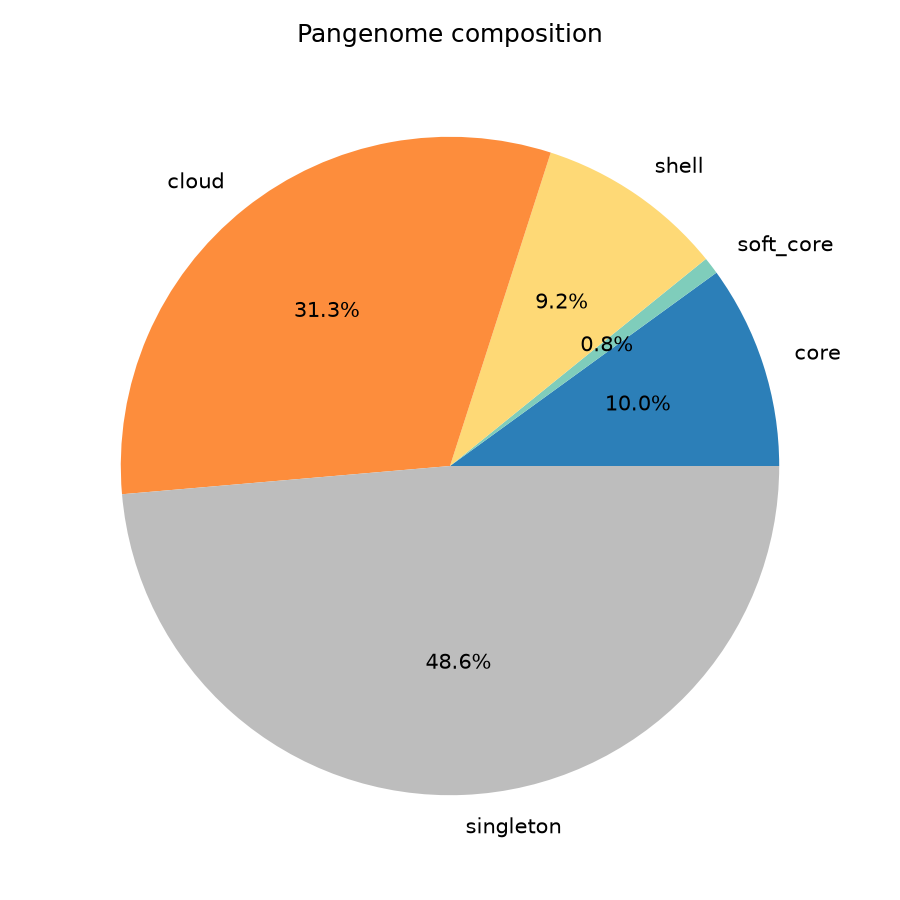
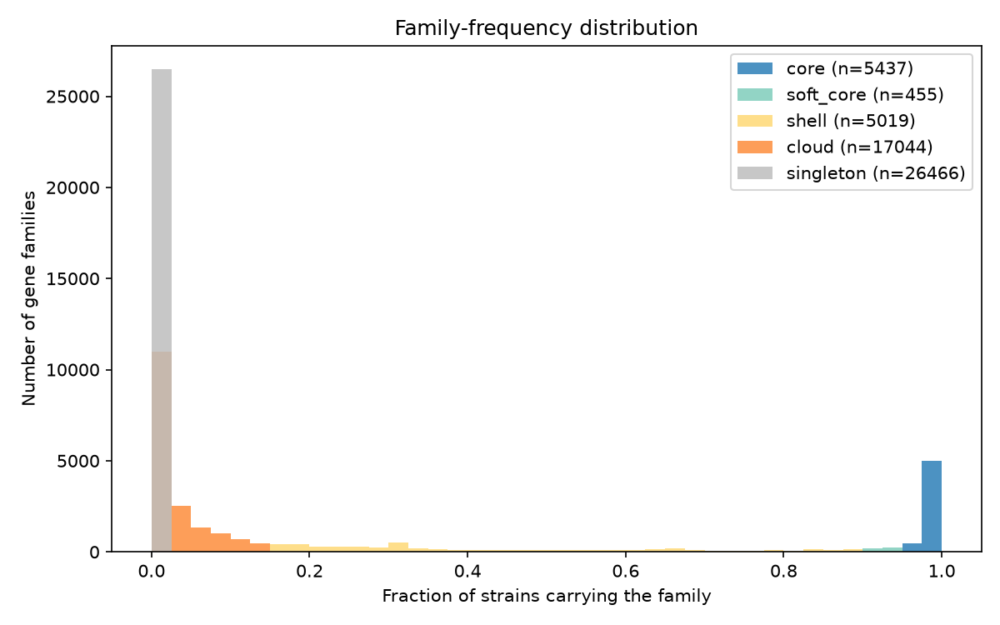
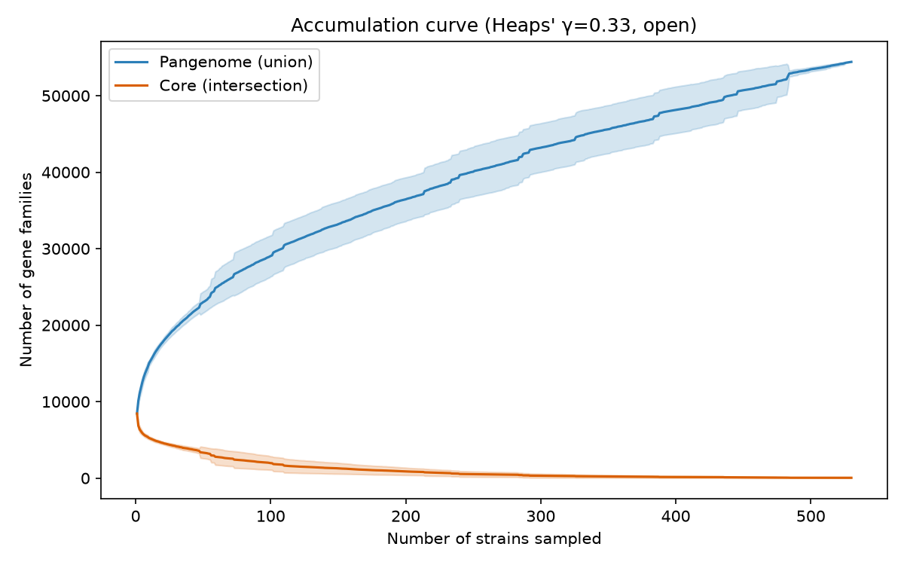
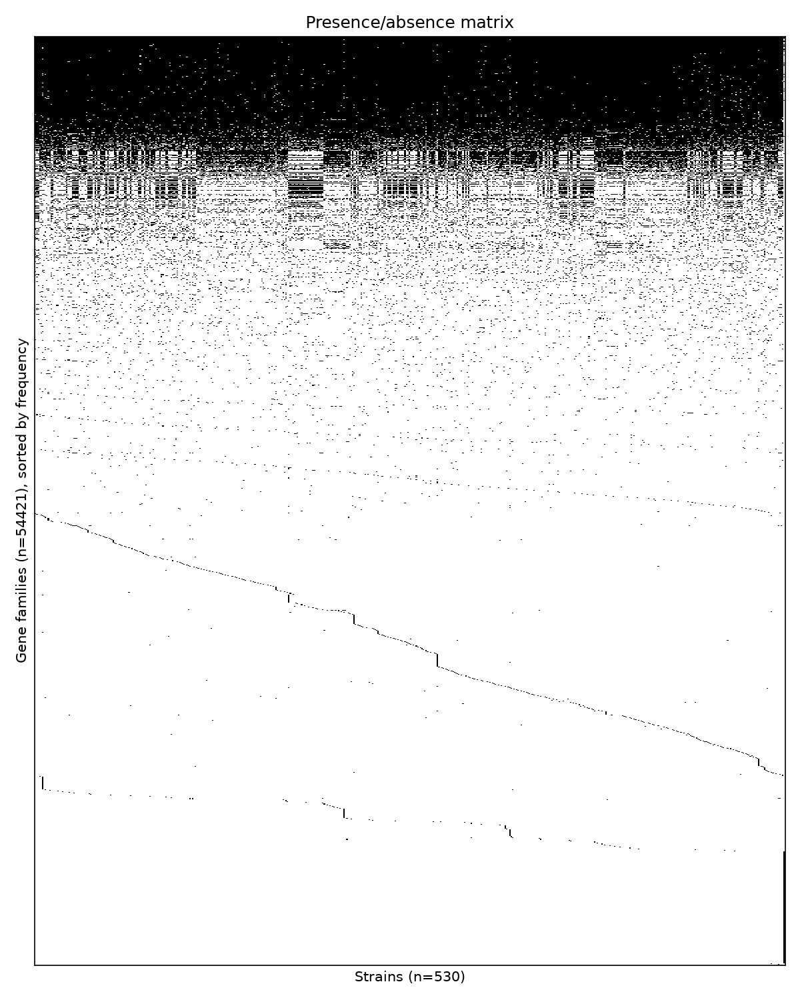
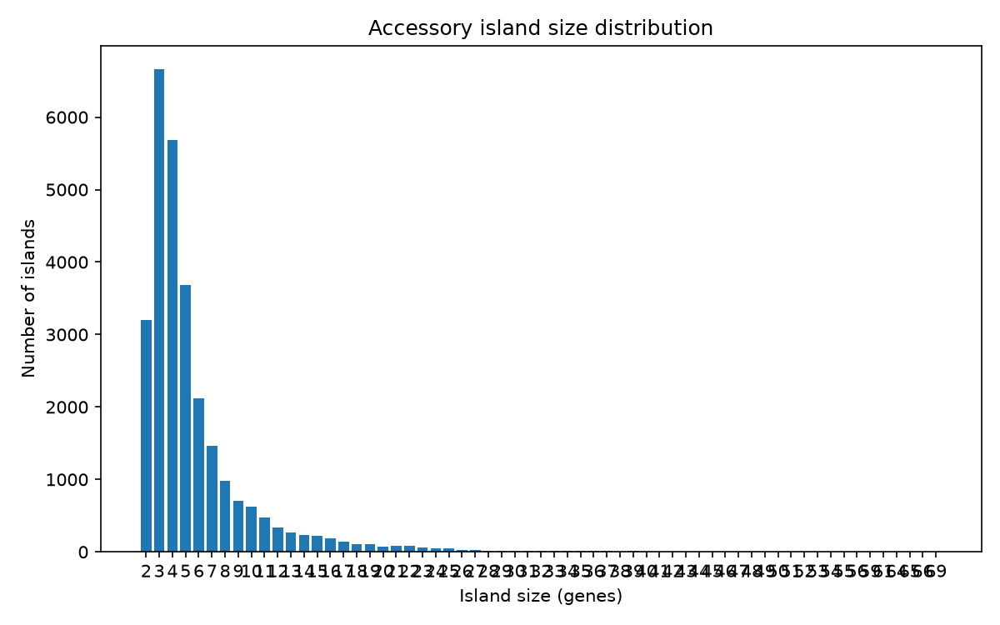
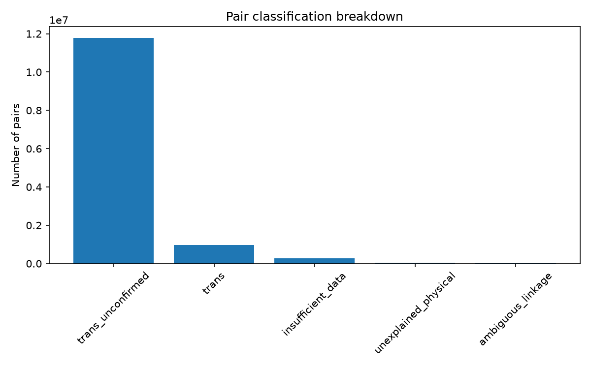
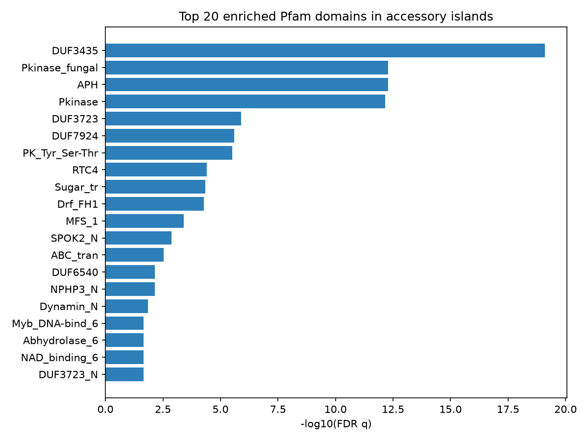

# Pangenome Island + Pfam Enrichment Report

## Pangenome composition

Total families: 54421

- **core**: 5437 (10.0%)
- **soft_core**: 455 (0.8%)
- **shell**: 5019 (9.2%)
- **cloud**: 17044 (31.3%)
- **singleton**: 26466 (48.6%)

## Pangenome openness

Heaps' law fit: κ=6500.4, γ=0.332 (R²=0.990) -- pangenome is **open** (γ < 1).

Extrapolated asymptotic core-genome size: 127 families.

## Per-strain summary

Families per strain: min=7396, median=8496, max=9081 (n=530 strains). See per_strain_summary.tsv for outliers.

**Outlier strains (singleton-count modified z-score beyond threshold):** Uree, B3476, Michoacan_2, VFC090, 4545-MICE, 485B-1_L_OLD_CPA0023, h5384, COCPO_103718, TX11, GT-139, M223, COCPO_34698, J_TORRES, SA14, B12398, CA14, SOIL_580-1_L_NEW_CPA0055, 409B-0_L_OLD_CPA0011, VFC083, SOIL_407-0_L_OLD_CPA0001, COCPO_4545, Beeville, B11019, NACVFR_4542, SOIL_604-1_L_OLD_CPA066, NACVFR_2566, GT-133, B11863, B17554, B11002, UTAH_9443, COCPO_195881, GT-100, CA1, COCSP-3505, B11518, GT-147, 730333_Guatemala

## Accessory islands

27836 statistically significant accessory islands found (built from adjacency of non-core genes, gated by containing at least one FDR-significant physically-linked pair).

**Top islands (by size):**

| Locus | Size | Strains | Pfam domains |
|---|---|---|---|
| UTAH_20380X2:scaffold_106:415-51663 | 69 | 1 | AAA,DEAD,DUF1653,DUF7415,DUF7979,DUF8537,Peptidase_M41,Phage_g100,Phage_lysozyme2,Proteasome,RMF,RNA_lig_T4_1,RlaP,Thg1,Thg1C |
| UTAH_20380X16:scaffold_64:187-51435 | 66 | 1 | AAA,DEAD,DUF1653,DUF7415,DUF7979,DUF8537,Peptidase_M41,Phage_g100,Phage_lysozyme2,Proteasome,RMF,RNA_lig_T4_1,RlaP,Thg1,Thg1C |
| UTAH_20380X5:scaffold_93:187-51435 | 65 | 1 | AAA,DEAD,DUF1653,DUF7415,DUF7979,DUF8537,Peptidase_M41,Phage_g100,Phage_lysozyme2,Proteasome,RMF,RNA_lig_T4_1,RlaP,Thg1,Thg1C |
| UTAH_23742X211:scaffold_1:9140-149294 | 65 | 1 | ABC_membrane,ABC_tran,APH,Alpha_kinase,BTB,Chromo,DUF3435,DUF3723,DUF6540,DUF6914,DUF7924,EcKL,Glyco_tranf_2_3,Glycos_transf_2,Laminin_I,Patatin,Phage_integrase,Pkinase,Pkinase_fungal,RsgA_GTPase,SPOK2_N,Shootin,zf-C3HC4,zf-C3HC4_2,zf-C3HC4_3 |
| UTAH_20380X10:scaffold_65:415-51663 | 64 | 1 | AAA,DEAD,DUF1653,DUF7415,DUF7979,DUF8537,Peptidase_M41,Phage_g100,Phage_lysozyme2,Proteasome,RMF,RNA_lig_T4_1,RlaP,Thg1,Thg1C |
| B3413:scaffold_39:94877-209006 | 61 | 1 | AAA,AAA_29,ABC_tran,APH,BCS1_N,DUF3435,DUF3723,DUF7924,F-box,F-box-like,FAD_binding_8,FKBP_C,HlyIII,NAD_binding_6,PK_Tyr_Ser-Thr,Patatin,Pkinase,Pkinase_fungal,RasGEF,RsgA_GTPase |
| B3226:scaffold_17:181823-299922 | 59 | 1 | AAA,AAA_29,ABC_tran,APH,BCS1_N,DUF3435,DUF3723,DUF7924,F-box,F-box-like,FAD_binding_8,FKBP_C,Ferric_reduct,HlyIII,NAD_binding_6,PK_Tyr_Ser-Thr,Patatin,Pkinase,Pkinase_fungal,RasGEF,RsgA_GTPase |
| B3313:scaffold_18:154755-264929 | 59 | 1 | AAA,AAA_29,ABC_tran,APH,BCS1_N,DUF3435,DUF3723,DUF7924,F-box,F-box-like,FAD_binding_8,FKBP_C,HlyIII,HrmA_N,NAD_binding_6,PK_Tyr_Ser-Thr,Patatin,Pkinase,Pkinase_fungal,RasGEF,RsgA_GTPase,zf_Tbcl_3,zf_Tbcl_4 |
| Uree:NW_003052500.1:893140-1046990 | 59 | 1 | Complex1_LYR,Complex1_LYR_2,EMG1,ISD11,LYRM2-like,dsDNA_bind |
| B3251:scaffold_75:405-104535 | 56 | 1 | AAA_29,ABC_tran,AFUB_07903_YDR124W_hel,APH,Ank,Ank_2,Ank_3,Ank_4,Ank_5,DUF3723,DUF3723_N,EST1_DNA_bind,F-box,F-box-like,FAD_binding_8,FKBP_C,Hexapep,HlyIII,Kdo,LbH_EIF2B,NAD_binding_6,Patatin,PhyH,SMC_N,SPOK2_N,UPF0242,zf-BED,zf-C2H2,zf-C2H2_11,zf-C2H2_4 |
| CA25:scaffold_81:732-121698 | 56 | 1 | AAA,AAA_16,AAA_29,AAA_lid_13,ABC_tran,AFUB_07903_YDR124W_hel,APH,Ank,Ank_2,Ank_3,Ank_4,Ank_5,DUF3723,DUF6540,DUF6589,DUF6914,DUF7025,DUF7924,Dynamin_N,EST1_DNA_bind,F-box,F-box-like,FAD_binding_8,FKBP_C,Hexapep,HlyIII,NAD_binding_6,PK_Tyr_Ser-Thr,Patatin,PhyH,Pkinase,Pkinase_fungal,RsgA_GTPase,SMC_N,zf-C3HC4,zf-C3HC4_2,zf-C3HC4_3,zf-RING_2,zf-RING_5,zf-RING_UBOX |
| Tucson_8:scaffold_59:23181-137387 | 55 | 1 | AAA,AAA_29,ABC_membrane,ABC_tran,APH,BCS1_N,DUF3435,DUF7924,F-box,F-box-like,FAD_binding_8,FKBP_C,HlyIII,NAD_binding_6,PK_Tyr_Ser-Thr,Patatin,Pkinase,Pkinase_fungal,RasGEF,RsgA_GTPase |
| UTAH_23742X208:scaffold_33:15359-125069 | 55 | 1 | AAA,ABC_membrane,ABC_tran,APH,BCS1_N,DUF3435,DUF3723,DUF7924,F-box,F-box-like,FAD_binding_8,FKBP_C,Glyco_tranf_2_3,HlyIII,NAD_binding_6,PK_Tyr_Ser-Thr,Patatin,Pkinase,Pkinase_fungal,RasGEF,RsgA_GTPase |
| B3348:scaffold_36:107707-221564 | 54 | 1 | AAA,AAA_29,ABC_membrane,ABC_tran,APH,BCS1_N,DUF3435,DUF3723,DUF7924,F-box,F-box-like,FKBP_C,HlyIII,HrmA_N,NAD_binding_6,PK_Tyr_Ser-Thr,Patatin,Peptidase_C48,Pkinase,Pkinase_fungal,RasGEF,RsgA_GTPase,zf_Tbcl_3,zf_Tbcl_4 |
| B3420:scaffold_8:266890-382848 | 54 | 1 | AAA,AAA_29,ABC_membrane,ABC_tran,APH,BCS1_N,DUF3435,DUF3723,DUF7924,F-box,F-box-like,FAD_binding_8,FKBP_C,Ferric_reduct,HlyIII,NAD_binding_6,PK_Tyr_Ser-Thr,Patatin,Peptidase_C48,Pkinase,Pkinase_fungal,RasGEF,RsgA_GTPase |
| M222:scaffold_72:1077-108562 | 54 | 1 | AAA,AAA_lid_BCS1,ABC_membrane,ABC_tran,AFUB_07903_YDR124W_hel,APH,BCS1_N,BTB,BTB_2,Choline_kinase,Chromo,DUF3435,DUF3723,DUF6540,DUF7924,EcKL,Glyco_tranf_2_3,Myb_DNA-bind_6,Myb_DNA-binding,NAD_binding_6,PK_Tyr_Ser-Thr,Pkinase,Pkinase_fungal,RsgA_GTPase,SPOK2_N,Wtap,Zn_clus,zf-RING_2,zf-RING_5 |
| Cocci_1400035797:scaffold_6:1817-115257 | 53 | 1 | APH,Alpha_kinase,BTB,Chromo,DUF2205,DUF3435,DUF3723,DUF6540,DUF6914,DUF7924,EcKL,Laminin_I,Phage_integrase,Pkinase,Pkinase_fungal,RTC4,SPOK2_N,Shootin,zf-C3HC4,zf-C3HC4_2,zf-C3HC4_3,zf-RING_2,zf-RING_5 |
| M195:scaffold_67:406-149828 | 52 | 1 | APH,Ank,Ank_2,Ank_4,Ank_5,Ank_KRIT1,CYTH,Chitin_bind_1,DUF3723,DUF3723_N,DUF6540,DUF6914,DUF7779,FAD_binding_8,Glyco_hydro_18,Methyltransf_23,Methyltransf_25,Myb_DNA-bind_5,NAD_binding_6,Patatin,Peptidase_C97,Pkinase,SPOK2_N,TPR_10,TPR_12,TPR_NPHP3,zf-RING_2 |
| UTAH_23742X214:scaffold_14:22696-250283 | 52 | 1 | AAA,ABC_membrane,AFUB_07903_YDR124W_hel,ApoB100_4ins,EST1_DNA_bind,FB_lectin,FKBP_C,PhyH,Pkinase,SPOK2_N |
| UTAH_23742X225:scaffold_8:22665-250250 | 52 | 1 | AAA,ABC_membrane,AFUB_07903_YDR124W_hel,APH,EST1_DNA_bind,FB_lectin,FKBP_C,PhyH,Pkinase,SPOK2_N |

## Pair classification breakdown

- **trans_unconfirmed**: 11773437
- **trans**: 966865
- **insufficient_data**: 281947
- **unexplained_physical**: 34124
- **ambiguous_linkage**: 16639

## Pfam domain enrichment

| Domain | Fisher p | FDR q |
|---|---|---|
| [DUF3435](https://www.ebi.ac.uk/interpro/entry/pfam/PF11917/) | 4.49e-23 | 7.93e-20 |
| [Pkinase_fungal](https://www.ebi.ac.uk/interpro/entry/pfam/PF17667/) | 6.73e-16 | 5.29e-13 |
| [APH](https://www.ebi.ac.uk/interpro/entry/pfam/PF01636/) | 8.99e-16 | 5.29e-13 |
| [Pkinase](https://www.ebi.ac.uk/interpro/entry/pfam/PF00069/) | 1.57e-15 | 6.92e-13 |
| [DUF3723](https://www.ebi.ac.uk/interpro/entry/pfam/PF12520/) | 3.61e-09 | 1.28e-06 |
| [DUF7924](https://www.ebi.ac.uk/interpro/entry/pfam/PF25545/) | 8.58e-09 | 2.52e-06 |
| [PK_Tyr_Ser-Thr](https://www.ebi.ac.uk/interpro/entry/pfam/PF07714/) | 1.21e-08 | 3.04e-06 |
| [RTC4](https://www.ebi.ac.uk/interpro/entry/pfam/PF14474/) | 1.82e-07 | 4.02e-05 |
| [Sugar_tr](https://www.ebi.ac.uk/interpro/entry/pfam/PF00083/) | 2.30e-07 | 4.50e-05 |
| [Drf_FH1](https://www.ebi.ac.uk/interpro/entry/pfam/PF06346/) | 3.01e-07 | 5.31e-05 |
| [MFS_1](https://www.ebi.ac.uk/interpro/entry/pfam/PF07690/) | 2.41e-06 | 3.87e-04 |
| [SPOK2_N](https://www.ebi.ac.uk/interpro/entry/pfam/PF27653/) | 9.02e-06 | 1.33e-03 |
| [ABC_tran](https://www.ebi.ac.uk/interpro/entry/pfam/PF00005/) | 2.18e-05 | 2.96e-03 |
| [DUF6540](https://www.ebi.ac.uk/interpro/entry/pfam/PF20174/) | 5.64e-05 | 7.12e-03 |
| [NPHP3_N](https://www.ebi.ac.uk/interpro/entry/pfam/PF24883/) | 6.15e-05 | 7.24e-03 |
| [Dynamin_N](https://www.ebi.ac.uk/interpro/entry/pfam/PF00350/) | 1.29e-04 | 1.42e-02 |
| [Myb_DNA-bind_6](https://www.ebi.ac.uk/interpro/entry/pfam/PF13921/) | 2.26e-04 | 2.23e-02 |
| [Abhydrolase_6](https://www.ebi.ac.uk/interpro/entry/pfam/PF12697/) | 2.45e-04 | 2.23e-02 |
| [NAD_binding_6](https://www.ebi.ac.uk/interpro/entry/pfam/PF08030/) | 2.53e-04 | 2.23e-02 |
| [DUF3723_N](https://www.ebi.ac.uk/interpro/entry/pfam/PF29418/) | 2.65e-04 | 2.23e-02 |
| [DUF676](https://www.ebi.ac.uk/interpro/entry/pfam/PF05057/) | 2.65e-04 | 2.23e-02 |
| [His-triad_hairpin](https://www.ebi.ac.uk/interpro/entry/pfam/PF28209/) | 3.33e-04 | 2.68e-02 |
| [Patatin](https://www.ebi.ac.uk/interpro/entry/pfam/PF01734/) | 4.00e-04 | 3.07e-02 |
| [ADH_N](https://www.ebi.ac.uk/interpro/entry/pfam/PF08240/) | 4.95e-04 | 3.65e-02 |
| [DUF7025](https://www.ebi.ac.uk/interpro/entry/pfam/PF22942/) | 5.50e-04 | 3.74e-02 |
| [SRF-TF](https://www.ebi.ac.uk/interpro/entry/pfam/PF00319/) | 5.50e-04 | 3.74e-02 |
