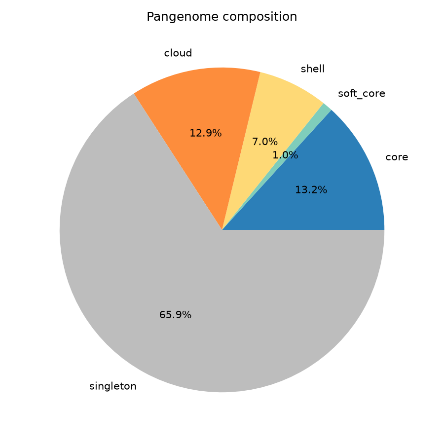
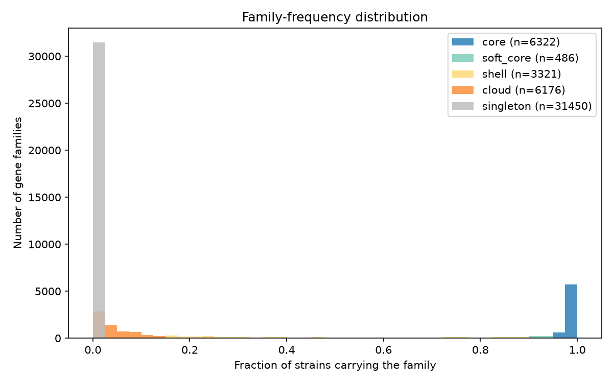
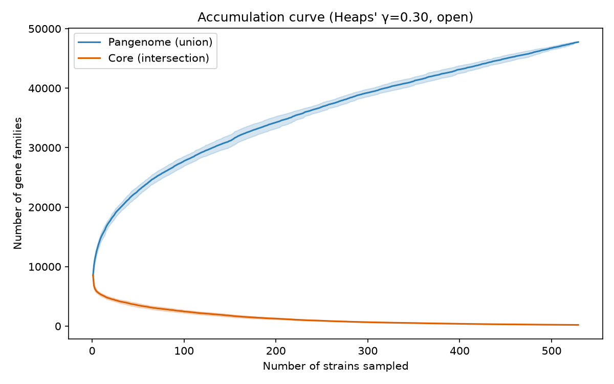
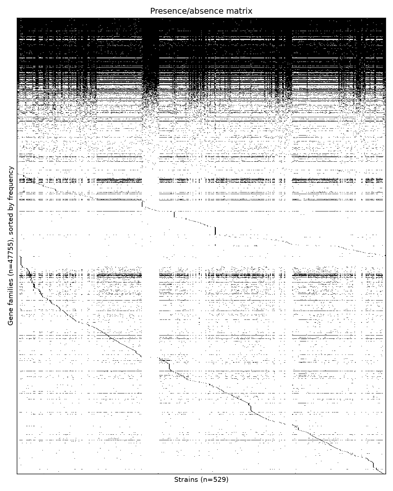
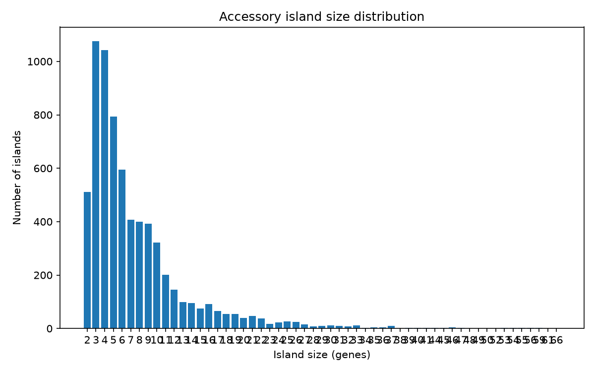
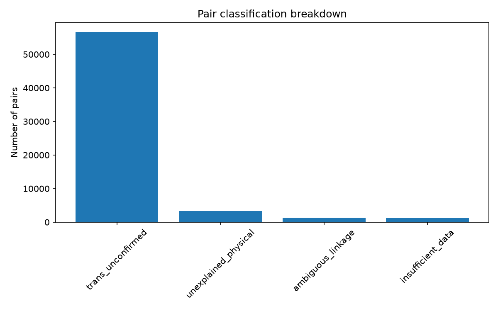
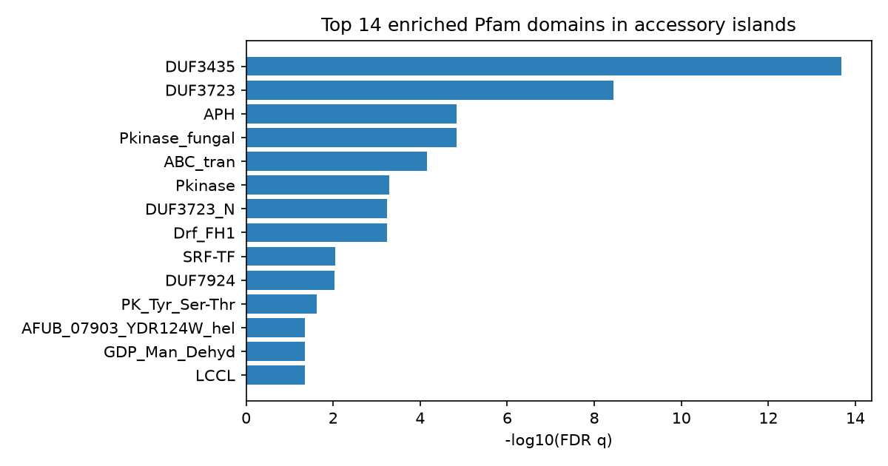

# Pangenome Island + Pfam Enrichment Report

## Pangenome composition

Total families: 47755

- **core**: 6322 (13.2%)
- **soft_core**: 486 (1.0%)
- **shell**: 3321 (7.0%)
- **cloud**: 6176 (12.9%)
- **singleton**: 31450 (65.9%)

## Pangenome openness

Heaps' law fit: κ=7274.5, γ=0.295 (R²=0.995) -- pangenome is **open** (γ < 1).

Extrapolated asymptotic core-genome size: 249 families.

## Per-strain summary

Families per strain: min=8026, median=8496, max=9085 (n=529 strains). See per_strain_summary.tsv for outliers.

**Outlier strains (singleton-count modified z-score beyond threshold):** UTAH_23742X260, SDVA38, UTAH_23742X170, B12496, B3476, UTAH_23742X235, B12495, CA7, B16338, Michoacan_2, UTAH_23742X241, UTAH_23742X31, UTAH_23742X214, CA25, UTAH_23742X111, CA5, SJV_8, B15142, B11034, CA8, B16364, SDVA1, GT-126, B14298, SJV_11, B15145, SJV_5, 4SD, UTAH_23742X123, SJV_7, SDVA4, GT-167, San_Diego_1, CA22, GT-104, B11035, B15257, B12220, CA23, SJV_2, B13956, GT-105, GT-121, GT-109, B14131, GT-117, A502-2, B11517, h5384, SJV_6, VFC052, SJV_9, GT-113, GT-125, A391, B11198, SDVA36, GT-140, A502-1, GT-127, M204, SJV_4, UTAH_23742X255, A432, UTAH_23742X206, B16339, UTAH_23742X211, B14288, CA4, GT-128, UTAH_23742X257, CA2, 5SD, Guerrero_1, UTAH_23742X225, B14135, GT-107, GT-111, B14132, B15368, UTAH_23742X71, UTAH_23742X205, GT-118, GT-114, GT-119, B14133, GT-108, SDVA2, UTAH_23742X153, CA9, COCSP-2006, CA30, UTAH_23742X223, CA15, CA27, B15317, CA29, GT-116, SJV_1, GT-132, UTAH_20380X10, GT-156, Washington_1, SDVA17, UTAH_23742X138, CA6, GT-169, CA26, CA17, UTAH_23742X227, B11873, B17567, SDVA3, CA24, UTAH_20380X16, Coahuila_1, CA28, 3M3, UTAH_23742X242, WA_211, COCSP-8945, CDC-202, CDC-212, 1M0, B17635, SDVA15, B12526, SJV_10, GT-146, SDVA6, CA3, 4M3, SDVA39, CDC-205, UTAH_23742X162, SDVA5, B12398, B11343, CA14, SDVA48, WA_221, B16536, B15146, VFC043, 409B-0_L_OLD_CPA0011, GT-163, B11057, B11080, RS, SDVA41, GT-129, B11019, B11587, SOIL_604-1_L_OLD_CPA066, CA20, GT-123, GT-133, 21SD, B16692, B12219, B11863, B14286, B17554, B11002, UTAH_9443, COCPO_195881, B0727_Argentina, GT-100, CA1, SDVA44, COCSP-3505, B11518, 730332_Guatemala, GT-147, 730333_Guatemala

## Accessory islands

6759 statistically significant accessory islands found (built from adjacency of non-core genes, gated by containing at least one FDR-significant physically-linked pair).

**Top islands (by size):**

| Locus | Size | Strains | Pfam domains |
|---|---|---|---|
| UTAH_23742X211:scaffold_1:7851-149294 | 66 | 1 | ABC_membrane,ABC_tran,APH,Alpha_kinase,BTB,Chromo,DUF3435,DUF3723,DUF6540,DUF6914,DUF7924,EST1_DNA_bind,EcKL,Glyco_tranf_2_3,Glycos_transf_2,Laminin_I,Phage_integrase,Pkinase,Pkinase_fungal,RsgA_GTPase,SPOK2_N,Shootin,zf-C3HC4,zf-C3HC4_2,zf-C3HC4_3 |
| B3413:scaffold_39:94877-209006 | 61 | 1 | AAA,AAA_29,ABC_tran,BCS1_N,DUF3723,DUF7924,FAD_binding_8,FKBP_C,HlyIII,NAD_binding_6,PK_Tyr_Ser-Thr,Patatin,Pkinase,RasGEF,RsgA_GTPase |
| B3226:scaffold_17:181823-299922 | 59 | 1 | AAA,AAA_29,ABC_tran,BCS1_N,DUF3723,DUF7924,FAD_binding_8,FKBP_C,HlyIII,NAD_binding_6,PK_Tyr_Ser-Thr,Patatin,Pkinase,RasGEF,RsgA_GTPase |
| B3313:scaffold_18:154755-264929 | 59 | 1 | AAA,AAA_29,ABC_tran,BCS1_N,DUF3723,DUF7924,FAD_binding_8,FKBP_C,HlyIII,NAD_binding_6,Patatin,RasGEF,RsgA_GTPase |
| B3251:scaffold_75:405-104535 | 56 | 1 | AAA_29,ABC_tran,AFUB_07903_YDR124W_hel,APH,Ank,Ank_2,Ank_3,Ank_4,Ank_5,EST1_DNA_bind,F-box,F-box-like,FAD_binding_8,HlyIII,Kdo,Mis12,NAD_binding_6,Patatin,PhyH,SMC_N,SPOK2_N,zf-BED,zf-C2H2,zf-C2H2_11,zf-C2H2_4 |
| CA25:scaffold_81:732-121698 | 56 | 1 | AAA,AAA_16,AAA_29,AAA_lid_13,ABC_tran,AFUB_07903_YDR124W_hel,APH,Ank,Ank_2,Ank_3,Ank_4,Ank_5,DUF3723,DUF6540,DUF6589,DUF6914,DUF7025,DUF7924,Dynamin_N,EST1_DNA_bind,F-box,F-box-like,FAD_binding_8,FKBP_C,Hexapep,HlyIII,NAD_binding_6,PK_Tyr_Ser-Thr,Patatin,PhyH,Pkinase,Pkinase_fungal,RsgA_GTPase,SMC_N,zf-C3HC4,zf-C3HC4_2,zf-C3HC4_3,zf-RING_2,zf-RING_5,zf-RING_UBOX |
| Tucson_8:scaffold_59:23181-137387 | 55 | 1 | AAA,BCS1_N,DUF7924,FAD_binding_8,FKBP_C,HlyIII,NAD_binding_6,Patatin,RasGEF |
| UTAH_23742X208:scaffold_33:15359-125069 | 55 | 1 | AAA,BCS1_N,DUF3723,DUF7924,FAD_binding_8,FKBP_C,HlyIII,NAD_binding_6,PK_Tyr_Ser-Thr,Patatin,Pkinase,RasGEF |
| B3348:scaffold_36:107707-221564 | 54 | 1 | AAA,BCS1_N,DUF3723,DUF7924,FKBP_C,HlyIII,PK_Tyr_Ser-Thr,Patatin,Pkinase,RasGEF |
| B3420:scaffold_8:266890-382848 | 54 | 1 | AAA,BCS1_N,DUF3723,DUF7924,FKBP_C,HlyIII,PK_Tyr_Ser-Thr,Patatin,Pkinase,RasGEF |
| M222:scaffold_72:1077-108562 | 54 | 1 | ABC_membrane,ABC_tran,APH,BTB,Choline_kinase,Chromo,DUF3723,DUF6540,EcKL,Glyco_tranf_2_3,NAD_binding_6,PK_Tyr_Ser-Thr,Pkinase,Pkinase_fungal,RsgA_GTPase,Zn_clus |
| Cocci_1400035797:scaffold_6:1817-115257 | 53 | 1 | APH,Alpha_kinase,BTB,Chromo,DUF2205,DUF3435,DUF3723,DUF6540,DUF6914,DUF7924,EcKL,Laminin_I,Phage_integrase,Pkinase,Pkinase_fungal,RTC4,SPOK2_N,Shootin,zf-C3HC4,zf-C3HC4_2,zf-C3HC4_3 |
| UTAH_23742X246:scaffold_44:15543-125254 | 52 | 1 | AAA,BCS1_N,DUF3723,DUF7924,FAD_binding_8,FKBP_C,HlyIII,NAD_binding_6,PK_Tyr_Ser-Thr,Patatin,Pkinase,RasGEF |
| SDVA2:scaffold_77:16010-134493 | 50 | 1 | ABC_membrane,ABC_tran,APH,Chromo,DUF2205,DUF3435,DUF3723,DUF6540,DUF6590,DUF6914,DUF7924,EcKL,Glyco_tranf_2_3,Glycos_transf_2,Laminin_I,Phage_integrase,Pkinase,Pkinase_fungal,RsgA_GTPase,SPOK2_N,Shootin |
| B17635:scaffold_6:10704-202989 | 49 | 1 | AFUB_07903_YDR124W_hel,APH,ATG16,ApoB100_4ins,EST1_DNA_bind,FKBP_C,Mis12,PhyH,SPOK2_N |
| M214:scaffold_70:25153-124557 | 48 | 1 | AAA_29,ABC_membrane,ABC_tran,APH,BTB,Chromo,DUF3435,DUF7924,Glyco_tranf_2_3,Glycos_transf_2,HlyIII,Laminin_I,PK_Tyr_Ser-Thr,Pkinase,Pkinase_fungal,RsgA_GTPase,SMC_N,SPOK2_N,Shootin,Zn_clus,zf-BED,zf-C2H2,zf-C2H2_11,zf-C2H2_4 |
| SDVA17:scaffold_25:577-110594 | 47 | 1 | ABC_membrane,ABC_tran,APH,DUF3435,DUF3723,DUF6540,DUF6914,DUF7924,EST1_DNA_bind,EcKL,Glyco_tranf_2_3,Glycos_transf_2,Laminin_I,Patatin,Pkinase,Pkinase_fungal,RTC4,RsgA_GTPase,SPOK2_N,Shootin |
| SDVA36:scaffold_24:566-110583 | 47 | 1 | ABC_membrane,ABC_tran,APH,DUF2205,DUF3435,DUF3723,DUF6540,DUF6914,DUF7924,EST1_DNA_bind,EcKL,Glyco_tranf_2_3,Glycos_transf_2,Laminin_I,Patatin,Pkinase,Pkinase_fungal,RTC4,RsgA_GTPase,SPOK2_N,Shootin |
| UTAH_23742X241:scaffold_17:87642-307329 | 47 | 1 | ABC_membrane,ABC_tran,APH,DUF3435,DUF3723,DUF6540,DUF6914,DUF7924,EST1_DNA_bind,EcKL,Glyco_tranf_2_3,Glycos_transf_2,Laminin_I,Patatin,Phage_integrase,Pkinase,Pkinase_fungal,RTC4,RsgA_GTPase,SPOK2_N,Shootin |
| SDVA5:scaffold_17:8228-205098 | 46 | 1 | AAA,AFUB_07903_YDR124W_hel,APH,ApoB100_4ins,EST1_DNA_bind,FKBP_C,PhyH,Pkinase_fungal,SPOK2_N |

## Pair classification breakdown

- **trans_unconfirmed**: 56628
- **unexplained_physical**: 3303
- **ambiguous_linkage**: 1351
- **insufficient_data**: 1145

## Pfam domain enrichment

| Domain | Fisher p | FDR q |
|---|---|---|
| [DUF3435](https://www.ebi.ac.uk/interpro/entry/pfam/PF11917/) | 2.60e-17 | 2.08e-14 |
| [DUF3723](https://www.ebi.ac.uk/interpro/entry/pfam/PF12520/) | 9.15e-12 | 3.65e-09 |
| [APH](https://www.ebi.ac.uk/interpro/entry/pfam/PF01636/) | 5.47e-08 | 1.44e-05 |
| [Pkinase_fungal](https://www.ebi.ac.uk/interpro/entry/pfam/PF17667/) | 7.22e-08 | 1.44e-05 |
| [ABC_tran](https://www.ebi.ac.uk/interpro/entry/pfam/PF00005/) | 4.35e-07 | 6.94e-05 |
| [Pkinase](https://www.ebi.ac.uk/interpro/entry/pfam/PF00069/) | 3.91e-06 | 5.21e-04 |
| [DUF3723_N](https://www.ebi.ac.uk/interpro/entry/pfam/PF29418/) | 5.11e-06 | 5.83e-04 |
| [Drf_FH1](https://www.ebi.ac.uk/interpro/entry/pfam/PF06346/) | 5.89e-06 | 5.88e-04 |
| [SRF-TF](https://www.ebi.ac.uk/interpro/entry/pfam/PF00319/) | 9.96e-05 | 8.83e-03 |
| [DUF7924](https://www.ebi.ac.uk/interpro/entry/pfam/PF25545/) | 1.19e-04 | 9.49e-03 |
| [PK_Tyr_Ser-Thr](https://www.ebi.ac.uk/interpro/entry/pfam/PF07714/) | 3.28e-04 | 2.38e-02 |
| [AFUB_07903_YDR124W_hel](https://www.ebi.ac.uk/interpro/entry/pfam/PF11001/) | 7.73e-04 | 4.40e-02 |
| [GDP_Man_Dehyd](https://www.ebi.ac.uk/interpro/entry/pfam/PF16363/) | 7.73e-04 | 4.40e-02 |
| [LCCL](https://www.ebi.ac.uk/interpro/entry/pfam/PF03815/) | 7.73e-04 | 4.40e-02 |
