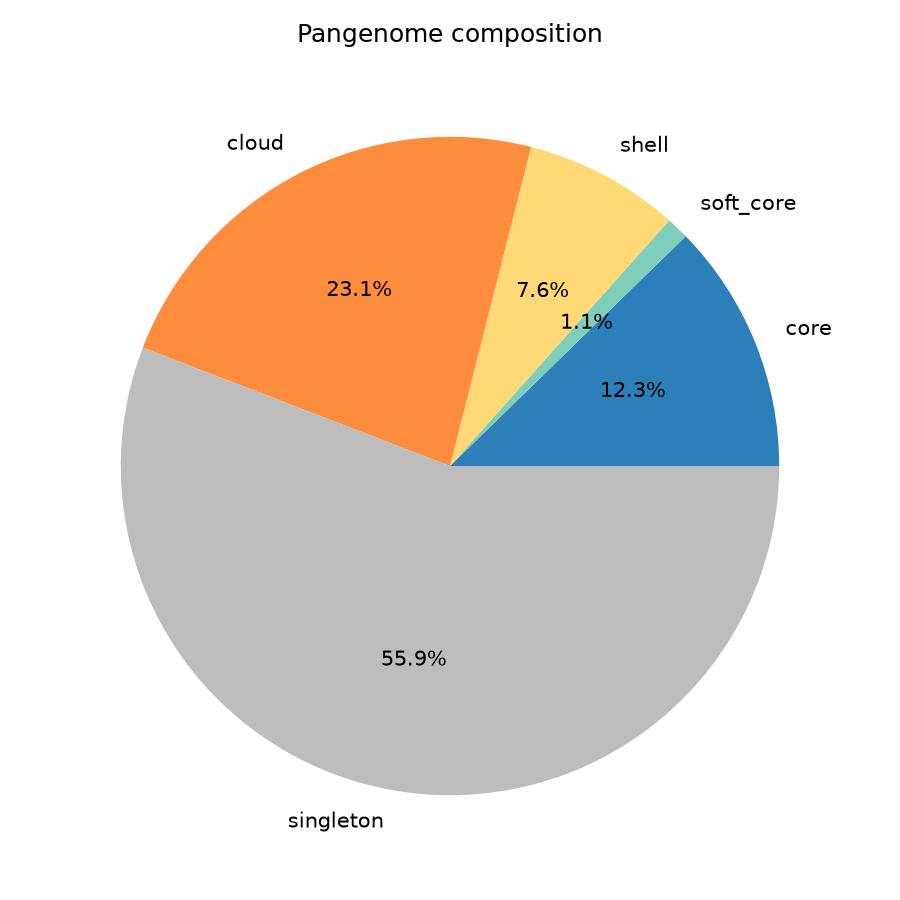
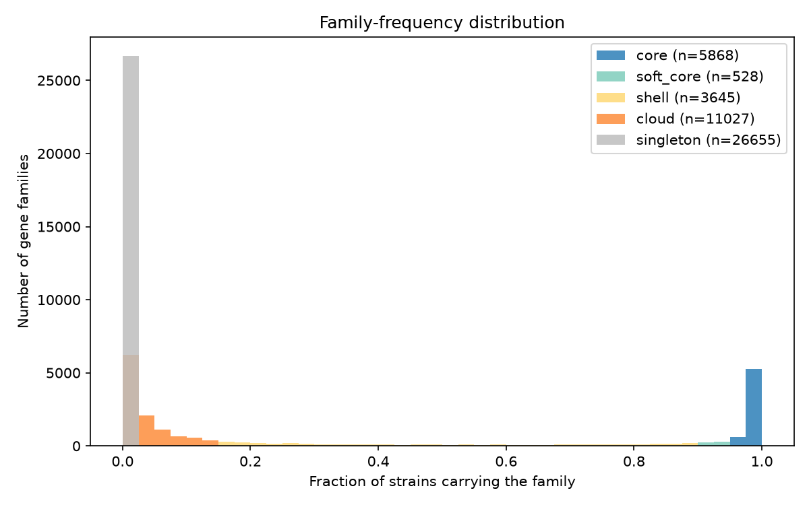
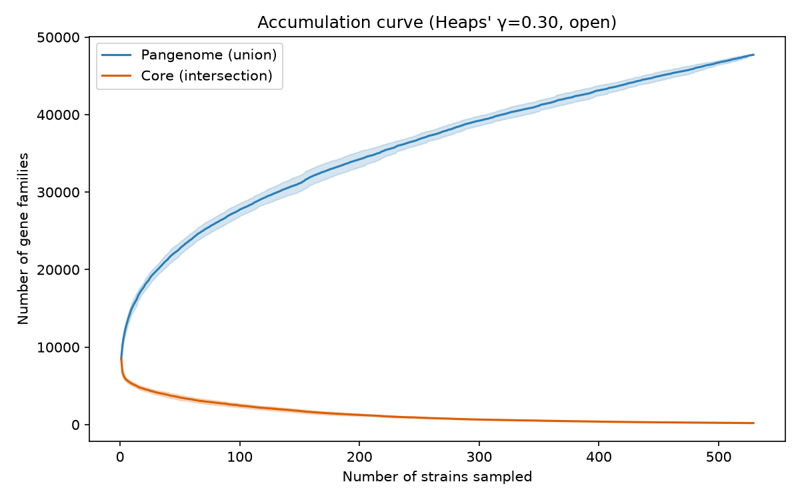
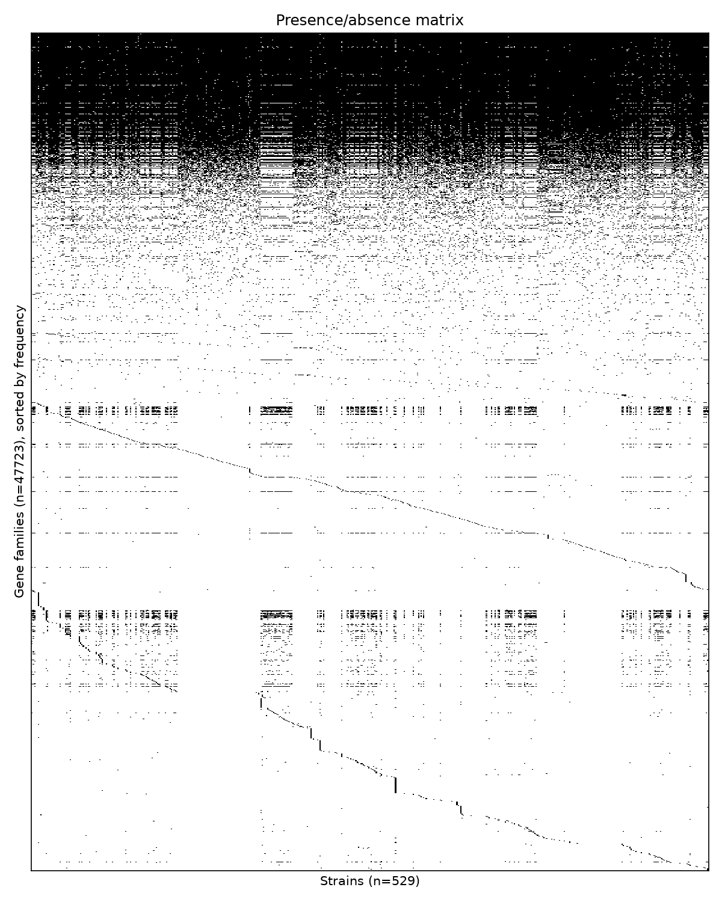
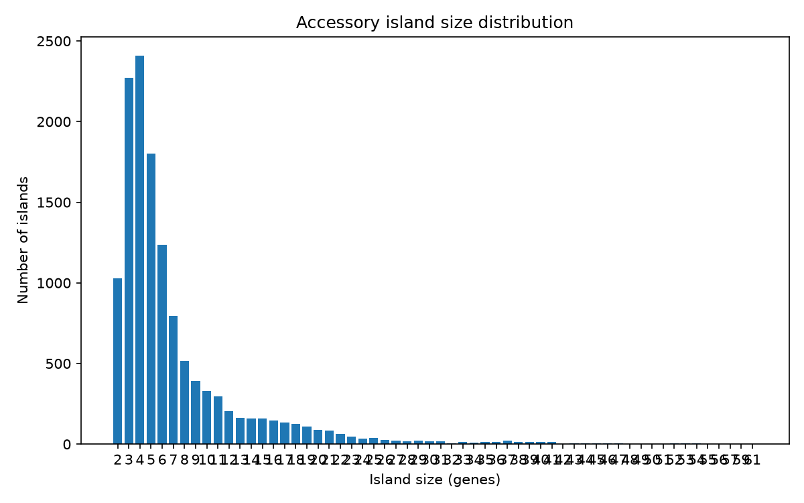
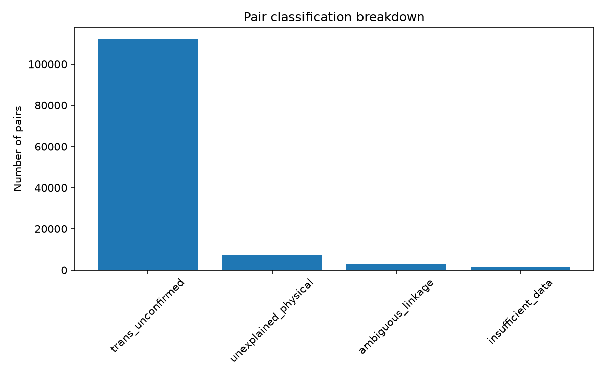
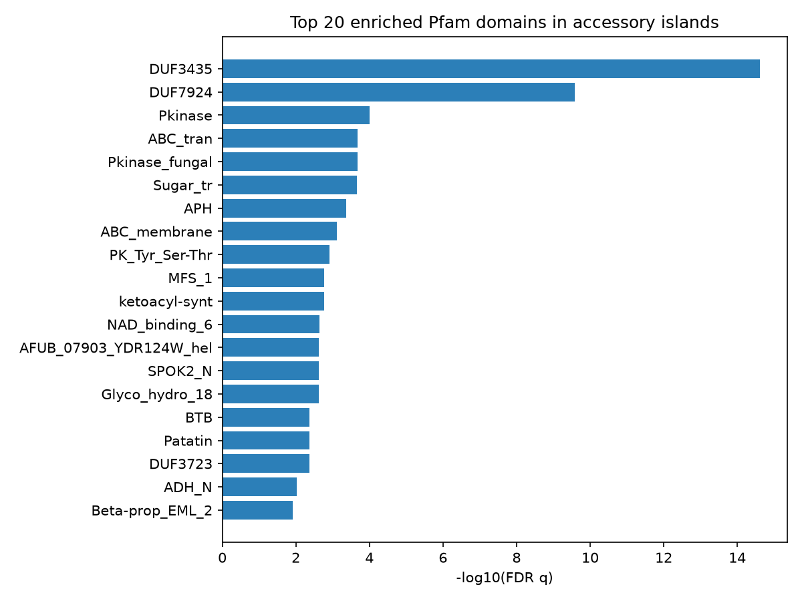

# Pangenome Island + Pfam Enrichment Report

## Pangenome composition

Total families: 47723

- **core**: 5868 (12.3%)
- **soft_core**: 528 (1.1%)
- **shell**: 3645 (7.6%)
- **cloud**: 11027 (23.1%)
- **singleton**: 26655 (55.9%)

## Pangenome openness

Heaps' law fit: κ=7271.8, γ=0.295 (R²=0.995) -- pangenome is **open** (γ < 1).

Extrapolated asymptotic core-genome size: 248 families.

## Per-strain summary

Families per strain: min=8026, median=8496, max=9084 (n=529 strains). See per_strain_summary.tsv for outliers.

**Outlier strains (singleton-count modified z-score beyond threshold):** UTAH_23742X260, SDVA38, UTAH_23742X170, B12496, B3476, UTAH_23742X235, B12495, CA7, B16338, Michoacan_2, UTAH_23742X241, UTAH_23742X31, UTAH_23742X214, CA25, UTAH_23742X111, CA5, 4545-MICE, SJV_8, 485B-1_L_OLD_CPA0023, B15142, B11034, CA8, B16364, SDVA1, GT-126, B14298, SJV_11, B15145, SJV_5, 4SD, UTAH_23742X123, SJV_7, SDVA4, GT-167, San_Diego_1, CA22, GT-104, B11035, B15257, B12220, CA23, SJV_2, B13956, GT-105, GT-121, GT-109, B14131, GT-117, A502-2, B11517, h5384, SJV_6, VFC052, SJV_9, GT-113, GT-125, A391, B11198, SDVA36, GT-140, A502-1, GT-127, M204, SJV_4, UTAH_23742X255, A432, UTAH_23742X206, B16339, UTAH_23742X211, B14288, CA4, GT-128, UTAH_23742X257, CA2, 5SD, Guerrero_1, UTAH_23742X225, B14135, GT-107, GT-111, B14132, B15368, UTAH_23742X71, UTAH_23742X205, GT-118, TX11, GT-114, GT-119, B14133, GT-108, SDVA2, UTAH_23742X153, CA9, COCSP-2006, CA30, UTAH_23742X223, CA15, CA27, B15317, CA29, GT-116, SJV_1, GT-132, UTAH_20380X10, GT-156, Washington_1, SDVA17, UTAH_23742X138, CA6, GT-169, CA26, CA17, UTAH_23742X227, B11873, B17567, SDVA3, CA24, UTAH_20380X16, Coahuila_1, CA28, 3M3, UTAH_23742X242, WA_211, COCSP-8945, CDC-202, CDC-212, 1M0, B17635, SDVA15, B12526, SJV_10, GT-146, SDVA6, CA3, M223, 4M3, COCPO_34698, J_TORRES, SDVA39, CDC-205, UTAH_23742X162, SDVA5, SA14, B12398, B11343, CA14, SDVA48, WA_221, B16536, B15146, VFC043, 409B-0_L_OLD_CPA0011, VFC083, GT-163, B11057, B11080, RS, Beeville, SDVA41, GT-129, B11019, NACVFR_4542, SOIL_604-1_L_OLD_CPA066, B11587, CA20, GT-123, NACVFR_2566, GT-133, 21SD, B16692, B12219, B11863, B14286, B17554, B11002, UTAH_9443, COCPO_195881, B0727_Argentina, GT-100, CA1, SDVA44, COCSP-3505, B11518, GT-147

## Accessory islands

12933 statistically significant accessory islands found (built from adjacency of non-core genes, gated by containing at least one FDR-significant physically-linked pair).

**Top islands (by size):**

| Locus | Size | Strains | Pfam domains |
|---|---|---|---|
| B3413:scaffold_39:94877-209006 | 61 | 1 | AAA,AAA_29,ABC_tran,APH,BCS1_N,DUF3435,DUF3723,DUF7924,F-box,F-box-like,FAD_binding_8,FKBP_C,HlyIII,NAD_binding_6,PK_Tyr_Ser-Thr,Patatin,Pkinase,Pkinase_fungal,RasGEF,RsgA_GTPase |
| UTAH_23742X211:scaffold_1:20762-149294 | 61 | 1 | ABC_membrane,ABC_tran,APH,Alpha_kinase,BTB,Chromo,DUF3435,DUF3723,DUF6540,DUF6914,EcKL,Glyco_tranf_2_3,Glycos_transf_2,Laminin_I,Pkinase,Pkinase_fungal,RsgA_GTPase,SPOK2_N,Shootin,zf-C3HC4,zf-C3HC4_2,zf-C3HC4_3 |
| B3226:scaffold_17:181823-299922 | 59 | 1 | AAA,AAA_29,ABC_tran,APH,BCS1_N,DUF3435,DUF3723,DUF7924,F-box,F-box-like,FAD_binding_8,FKBP_C,Ferric_reduct,HlyIII,NAD_binding_6,PK_Tyr_Ser-Thr,Patatin,Pkinase,Pkinase_fungal,RasGEF,RsgA_GTPase |
| B3313:scaffold_18:154755-264929 | 59 | 1 | AAA,AAA_29,ABC_tran,APH,BCS1_N,DUF3435,DUF3723,DUF7924,F-box,F-box-like,FAD_binding_8,FKBP_C,HlyIII,HrmA_N,NAD_binding_6,PK_Tyr_Ser-Thr,Patatin,Pkinase,Pkinase_fungal,RasGEF,RsgA_GTPase,zf_Tbcl_3,zf_Tbcl_4 |
| COCPO_Galgiani:scaffold_25:205409-347778 | 57 | 1 | AAA,AAA_16,AAA_2,AAA_5,AAA_lid_3,AIM11_N,APH,ARB_00926,ARM_ARMC5,ARM_PUB,Aa_trans,Abhydrolase_3,Acetyltransf_1,Acetyltransf_3,Amidase,Arm,Arm_3,Aspzincin_M35,BD-FAE,Beta-lactamase,CBM53,CBM_21,COesterase,DUF3433,DUF7066,DUF7923,DUF815,ECH_1,ECH_2,Fung_rhodopsin,G-patch,G-patch_2,GGACT,Glyco_hydro_18,Glyco_hydro_47,HEAT,HEAT_2,HEAT_EZ,HET,IBB,M20_dimer,MFS_1,MFS_4,MoaE,NAD_binding_8,OB_PRS7,PHO4,POT1,POT1PC,Peptidase_M20,Peptidase_M35,Prot_ATP_ID_OB_C,RRM_1,RuvB_N,SCO1-SenC,SIL1_FES1_HPBP1_C,SLAC1,TMCO6,TRAP_alpha,Tfb5,Yae1_N,Zn_ribbon_RanBP,zf-CCCH_12,zf-CCCH_tandem |
| B3251:scaffold_75:405-104535 | 56 | 1 | AAA_29,ABC_tran,AFUB_07903_YDR124W_hel,APH,Ank,Ank_2,Ank_3,Ank_4,Ank_5,DUF3723,DUF3723_N,EST1_DNA_bind,F-box,F-box-like,FAD_binding_8,FKBP_C,Hexapep,HlyIII,Kdo,LbH_EIF2B,Mis12,NAD_binding_6,Patatin,PhyH,SMC_N,SPOK2_N,UPF0242,zf-BED,zf-C2H2,zf-C2H2_11,zf-C2H2_4 |
| CA25:scaffold_81:732-121698 | 56 | 1 | AAA_29,ABC_tran,AFUB_07903_YDR124W_hel,APH,Ank,Ank_2,Ank_3,Ank_4,Ank_5,DUF3723,DUF6540,DUF6589,DUF6914,Dynamin_N,EST1_DNA_bind,F-box,F-box-like,FAD_binding_8,Hexapep,HlyIII,LbH_EIF2B,NAD_binding_6,PK_Tyr_Ser-Thr,Patatin,PhyH,Pkinase,Pkinase_fungal,RsgA_GTPase,SMC_N,zf-C3HC4,zf-C3HC4_2,zf-C3HC4_3,zf-RING_2,zf-RING_5,zf-RING_UBOX |
| Tucson_8:scaffold_59:23181-137387 | 55 | 1 | AAA,AAA_29,ABC_tran,APH,BCS1_N,DUF3435,DUF7924,F-box,F-box-like,FAD_binding_8,FKBP_C,HlyIII,NAD_binding_6,PK_Tyr_Ser-Thr,Patatin,Pkinase,Pkinase_fungal,RasGEF,RsgA_GTPase |
| UTAH_23742X208:scaffold_33:15359-125069 | 55 | 1 | AAA,ABC_membrane,ABC_tran,APH,BCS1_N,DUF3435,DUF3723,DUF7924,F-box,F-box-like,FAD_binding_8,FKBP_C,HlyIII,NAD_binding_6,PK_Tyr_Ser-Thr,Patatin,Pkinase,Pkinase_fungal,RasGEF,RsgA_GTPase |
| B3348:scaffold_36:107707-221564 | 54 | 1 | AAA,AAA_29,ABC_tran,APH,BCS1_N,DUF3435,DUF3723,DUF7924,F-box,F-box-like,FKBP_C,HlyIII,HrmA_N,NAD_binding_6,PK_Tyr_Ser-Thr,Patatin,Peptidase_C48,Pkinase,Pkinase_fungal,RasGEF,RsgA_GTPase,zf_Tbcl_3,zf_Tbcl_4 |
| B3420:scaffold_8:266890-382848 | 54 | 1 | AAA,AAA_29,ABC_tran,APH,BCS1_N,DUF3435,DUF3723,DUF7924,F-box,F-box-like,FAD_binding_8,FKBP_C,Ferric_reduct,HlyIII,NAD_binding_6,PK_Tyr_Ser-Thr,Patatin,Peptidase_C48,Pkinase,Pkinase_fungal,RasGEF,RsgA_GTPase |
| M214:scaffold_33:30540-268794 | 54 | 1 | AAA,AAA_16,AAA_2,AAA_5,AAA_lid_3,AIM11_N,APH,ARB_00926,ARM_ARMC5,ARM_PUB,Aa_trans,Abhydrolase_3,Acetyltransf_1,Acetyltransf_3,Amidase,Amidoligase_2,Arm,Arm_3,Aspzincin_M35,BD-FAE,Beta-lactamase,CBM53,CBM_21,COesterase,DUF3433,DUF6540,DUF7066,DUF7923,DUF815,ECH_1,ECH_2,Fung_rhodopsin,G-patch,G-patch_2,GGACT,Glyco_hydro_18,Glyco_hydro_47,HEAT,HEAT_2,HEAT_EZ,HET,IBB,M20_dimer,MFS_1,MoaE,NAD_binding_8,NMB1110-like_C,OB_PRS7,PHO4,POT1,POT1PC,Peptidase_M20,Peptidase_M35,Prot_ATP_ID_OB_C,RRM_1,RuvB_N,SCO1-SenC,SIL1_FES1_HPBP1_C,SLAC1,TMCO6,TRAP_alpha,Tfb5,Yae1_N,Zn_ribbon_RanBP,zf-CCCH_12,zf-CCCH_tandem |
| M222:scaffold_72:1077-108562 | 54 | 1 | AAA,AAA_lid_BCS1,ABC_membrane,ABC_tran,AFUB_07903_YDR124W_hel,APH,BCS1_N,BTB,BTB_2,Choline_kinase,Chromo,DUF3435,DUF3723,DUF6540,DUF7924,EcKL,Glyco_tranf_2_3,Myb_DNA-bind_6,Myb_DNA-binding,NAD_binding_6,PK_Tyr_Ser-Thr,Pkinase,Pkinase_fungal,RsgA_GTPase,SPOK2_N,Wtap,Zn_clus,zf-RING_2,zf-RING_5 |
| 485B-1_L_OLD_CPA0023:scaffold_15:213676-344673 | 53 | 1 | AAA,AAA_16,AAA_2,AAA_5,AAA_lid_3,AIM11_N,APH,ARB_00926,ARM_ARMC5,ARM_PUB,Aa_trans,Abhydrolase_3,Acetyltransf_1,Acetyltransf_3,Amidase,Arm,Arm_3,Aspzincin_M35,BD-FAE,Beta-lactamase,CBM53,CBM_21,COesterase,DUF3433,DUF7066,DUF7923,DUF815,ECH_1,ECH_2,G-patch,G-patch_2,GGACT,Glyco_hydro_18,Glyco_hydro_47,HEAT,HEAT_2,HEAT_EZ,HET,IBB,M20_dimer,MFS_1,MoaE,NAD_binding_8,OB_PRS7,PHO4,PK_Tyr_Ser-Thr,POT1,POT1PC,Peptidase_M20,Peptidase_M35,Pkinase,Prot_ATP_ID_OB_C,RRM_1,RuvB_N,SCO1-SenC,SIL1_FES1_HPBP1_C,SLAC1,TMCO6,TRAP_alpha,Tfb5,Yae1_N,Zn_ribbon_RanBP,zf-CCCH_12,zf-CCCH_tandem |
| Cocci_1400035797:scaffold_6:1817-115257 | 53 | 1 | APH,Alpha_kinase,BTB,Chromo,DUF2205,DUF3435,DUF3723,DUF6540,DUF6914,DUF7924,EcKL,Laminin_I,Phage_integrase,Pkinase,Pkinase_fungal,RTC4,SPOK2_N,Shootin,zf-C3HC4,zf-C3HC4_2,zf-C3HC4_3,zf-RING_2,zf-RING_5 |
| M199:scaffold_41:30490-173995 | 53 | 1 | AAA,AAA_16,AAA_2,AAA_5,AAA_lid_3,AIM11_N,APH,ARB_00926,ARM_ARMC5,ARM_PUB,Aa_trans,Abhydrolase_3,Acetyltransf_1,Acetyltransf_3,Amidase,Arm,Arm_3,Aspzincin_M35,BD-FAE,Beta-lactamase,CBM53,CBM_21,COesterase,DUF3433,DUF7066,DUF7923,DUF815,ECH_1,ECH_2,Fung_rhodopsin,G-patch,G-patch_2,GGACT,Glyco_hydro_18,Glyco_hydro_47,HEAT,HEAT_2,HEAT_EZ,HET,IBB,M20_dimer,MFS_1,MoaE,NAD_binding_8,OB_PRS7,PHO4,POT1,POT1PC,Peptidase_M20,Peptidase_M35,Prot_ATP_ID_OB_C,RRM_1,RuvB_N,SCO1-SenC,SIL1_FES1_HPBP1_C,SLAC1,TMCO6,TRAP_alpha,Tfb5,Yae1_N,Zn_ribbon_RanBP,zf-CCCH_12,zf-CCCH_tandem |
| M195:scaffold_67:406-149828 | 52 | 1 | APH,Ank,Ank_2,Ank_4,Ank_5,Ank_KRIT1,CYTH,Chitin_bind_1,DUF3723,DUF3723_N,DUF6540,DUF6914,DUF7779,FAD_binding_8,Glyco_hydro_18,Methyltransf_23,Methyltransf_25,Myb_DNA-bind_5,NAD_binding_6,Patatin,Peptidase_C97,Pkinase,SPOK2_N,TPR_10,TPR_12,TPR_NPHP3,zf-RING_2 |
| UTAH_23742X214:scaffold_14:22696-250283 | 52 | 1 | AFUB_07903_YDR124W_hel,PhyH |
| UTAH_23742X225:scaffold_8:22665-250250 | 52 | 1 | AFUB_07903_YDR124W_hel,PhyH |
| UTAH_23742X241:scaffold_25:66569-294156 | 52 | 1 | AFUB_07903_YDR124W_hel,PhyH |

## Pair classification breakdown

- **trans_unconfirmed**: 112193
- **unexplained_physical**: 7275
- **ambiguous_linkage**: 3019
- **insufficient_data**: 1755

## Pfam domain enrichment

| Domain | Fisher p | FDR q |
|---|---|---|
| [DUF3435](https://www.ebi.ac.uk/interpro/entry/pfam/PF11917/) | 1.91e-18 | 2.40e-15 |
| [DUF7924](https://www.ebi.ac.uk/interpro/entry/pfam/PF25545/) | 4.19e-13 | 2.64e-10 |
| [Pkinase](https://www.ebi.ac.uk/interpro/entry/pfam/PF00069/) | 2.39e-07 | 1.00e-04 |
| [ABC_tran](https://www.ebi.ac.uk/interpro/entry/pfam/PF00005/) | 6.81e-07 | 2.12e-04 |
| [Pkinase_fungal](https://www.ebi.ac.uk/interpro/entry/pfam/PF17667/) | 8.44e-07 | 2.12e-04 |
| [Sugar_tr](https://www.ebi.ac.uk/interpro/entry/pfam/PF00083/) | 1.05e-06 | 2.19e-04 |
| [APH](https://www.ebi.ac.uk/interpro/entry/pfam/PF01636/) | 2.39e-06 | 4.30e-04 |
| [ABC_membrane](https://www.ebi.ac.uk/interpro/entry/pfam/PF00664/) | 4.80e-06 | 7.54e-04 |
| [PK_Tyr_Ser-Thr](https://www.ebi.ac.uk/interpro/entry/pfam/PF07714/) | 8.57e-06 | 1.20e-03 |
| [MFS_1](https://www.ebi.ac.uk/interpro/entry/pfam/PF07690/) | 1.45e-05 | 1.69e-03 |
| [ketoacyl-synt](https://www.ebi.ac.uk/interpro/entry/pfam/PF00109/) | 1.48e-05 | 1.69e-03 |
| [NAD_binding_6](https://www.ebi.ac.uk/interpro/entry/pfam/PF08030/) | 2.20e-05 | 2.30e-03 |
| [AFUB_07903_YDR124W_hel](https://www.ebi.ac.uk/interpro/entry/pfam/PF11001/) | 2.55e-05 | 2.34e-03 |
| [SPOK2_N](https://www.ebi.ac.uk/interpro/entry/pfam/PF27653/) | 2.68e-05 | 2.34e-03 |
| [Glyco_hydro_18](https://www.ebi.ac.uk/interpro/entry/pfam/PF00704/) | 2.79e-05 | 2.34e-03 |
| [BTB](https://www.ebi.ac.uk/interpro/entry/pfam/PF00651/) | 5.69e-05 | 4.26e-03 |
| [Patatin](https://www.ebi.ac.uk/interpro/entry/pfam/PF01734/) | 5.76e-05 | 4.26e-03 |
| [DUF3723](https://www.ebi.ac.uk/interpro/entry/pfam/PF12520/) | 6.11e-05 | 4.27e-03 |
| [ADH_N](https://www.ebi.ac.uk/interpro/entry/pfam/PF08240/) | 1.40e-04 | 9.27e-03 |
| [Beta-prop_EML_2](https://www.ebi.ac.uk/interpro/entry/pfam/PF23414/) | 1.94e-04 | 1.22e-02 |
| [Myb_DNA-bind_6](https://www.ebi.ac.uk/interpro/entry/pfam/PF13921/) | 3.64e-04 | 2.08e-02 |
| [Thiolase_N](https://www.ebi.ac.uk/interpro/entry/pfam/PF00108/) | 3.64e-04 | 2.08e-02 |
| [GloB_C](https://www.ebi.ac.uk/interpro/entry/pfam/PF28402/) | 6.62e-04 | 3.62e-02 |
| [Helicase_C](https://www.ebi.ac.uk/interpro/entry/pfam/PF00271/) | 7.49e-04 | 3.92e-02 |
